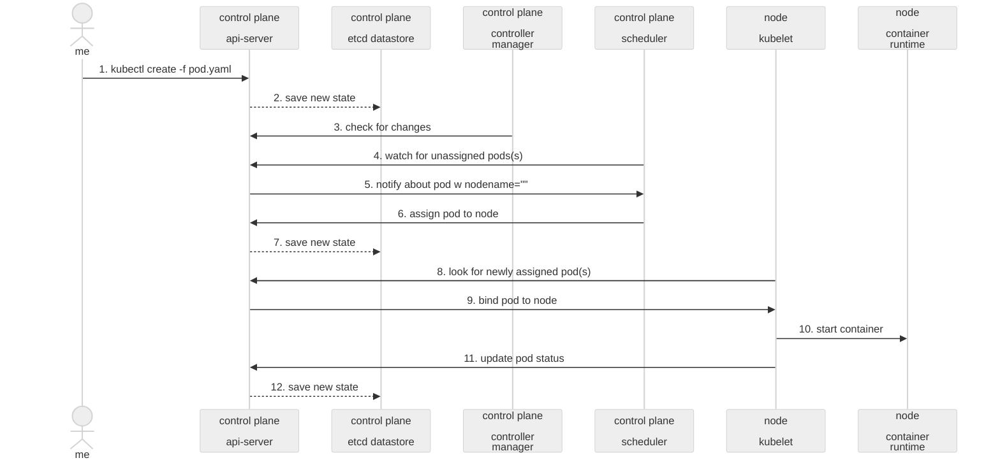

# Kubernetes Deployment and Scaling Skill

This skill provides comprehensive support for deploying and scaling containerized applications on Kubernetes, from simple hello-world deployments to production-grade systems with autoscaling, security, and monitoring.

## Kubernetes Control Plane Components and Reconciliation Loop

Understanding how Kubernetes maintains desired state through its control plane components and reconciliation loop is essential for effective deployments.

### Control Plane Component Responsibilities

#### API Server (kube-apiserver)
- **Frontend of the control plane** - Exposes the Kubernetes API
- **State storage** - Stores and retrieves cluster state from etcd
- **Authentication and authorization** - Validates requests
- **Watch mechanism** - Enables controllers and kubelets to watch for changes
- **State synchronization** - Ensures all components have consistent view

#### etcd
- **Distributed key-value store** - Stores all cluster state
- **Consistency** - Ensures data consistency across control plane
- **Durability** - Persists cluster configuration and state
- **Watch notifications** - Notifies API server of state changes

#### Controller Manager (kube-controller-manager)
- **Runs controllers** - Replication, endpoints, namespace, service accounts
- **Reconciliation loop** - Continuously compares desired vs current state
- **Resource lifecycle** - Manages creation, updates, and deletion
- **Leader election** - Ensures only one active controller in HA setups

#### Scheduler (kube-scheduler)
- **Pod placement** - Selects appropriate nodes for pod deployment
- **Resource optimization** - Considers resource requirements and constraints
- **Scheduling policies** - Applies affinity, taints, and tolerations
- **Node selection** - Evaluates nodes based on filters and priorities

#### kubelet (Node Component)
- **Pod execution** - Runs containers on nodes as instructed
- **Health reporting** - Reports pod and node status to API server
- **Current state reporting** - Updates API server with actual state
- **API server communication** - Receives pod specifications and reports status

### Reconciliation Loop Process

The reconciliation loop is the core mechanism that ensures desired state matches actual state:

1. **Desired State Creation**: User creates resources via kubectl (pods, deployments, services)
2. **State Persistence**: API server stores desired state in etcd
3. **Watch Trigger**: Controllers and scheduler watch for relevant changes
4. **Current State Assessment**: Components assess current cluster state
5. **Gap Analysis**: Compare desired vs current state
6. **Action Execution**: Take actions to align current state with desired state
7. **Status Update**: Report new state back to API server
8. **Loop Continuation**: Repeat continuously to maintain consistency

### Component Collaboration Flow

```
User Action → API Server → etcd (Store Desired State)
      ↓
Scheduler Watches → Finds Suitable Node → Updates Pod Spec
      ↓
Kubelet Watches → Receives Pod Assignment → Starts Containers
      ↓
Controller Watches → Monitors Actual State → Adjusts as Needed
      ↓
Status Updates → API Server → etcd (Store Current State)
```

### Detailed Reconciliation Process

The reconciliation loop follows this detailed sequence:

1. **User Action**: A user creates/modifies a resource (e.g., Deployment) via kubectl or API call
2. **API Server Storage**: The API server validates the request and stores the desired state in etcd
3. **Controller Monitoring**: Controllers continuously watch for changes in the desired state through the API server
4. **Actual State Assessment**: Controllers compare the desired state with the actual state of the cluster
5. **Action Execution**: When discrepancies are detected, controllers take corrective actions
6. **State Updates**: As actions are executed, the actual state changes, which is reflected in etcd
7. **Continuous Loop**: The process repeats continuously to ensure the actual state matches the desired state

### Key Principles of Reconciliation

- **Eventual Consistency**: The system continuously works toward the desired state, eventually converging
- **Idempotency**: Actions can be safely repeated without causing unintended side effects
- **Distributed Coordination**: Multiple controllers operate independently while coordinating through etcd
- **Watch Mechanism**: Controllers use efficient watch mechanisms rather than constant polling
- **Rate Limiting**: Controllers implement backoff strategies to prevent overwhelming the system

### Failure Handling in Reconciliation

- **Self-Healing**: When a Pod crashes, the ReplicaSet controller creates a new one to maintain the desired replica count
- **Node Failures**: The Node Controller detects failed nodes and marks their Pods as needing replacement
- **Retry Logic**: Failed operations are retried with exponential backoff to handle transient issues
- **Leader Election**: Critical controllers support leader election to ensure only one instance makes decisions at a time

### Example: Pod Creation Reconciliation

1. **kubectl create -f pod.yaml** → API Server receives pod specification
2. **API Server saves** → Pod object stored in etcd with `nodeName=""`
3. **Scheduler watches** → Detects unscheduled pod, selects node based on resource requirements, constraints, and policies
4. **Scheduler updates** → Pod object in etcd with `nodeName="node-1"`
5. **Kubelet watches** → Detects pod assigned to its node through the API server
6. **Kubelet executes** → Starts container using container runtime and reports status back
7. **Kubelet reports** → Updates pod status to `Running` and sends health information
8. **API Server syncs** → Updates etcd with new status
9. **Controllers monitor** → Continuously check that the pod is running as expected
10. **Reconciliation loop continues** → If pod fails, controllers create a replacement to maintain desired state

### Mermaid Sequence Diagram: K8s System Flow

Here's a visualization of the interactions between components during the reconciliation process:



## When to Use This Skill

Use this skill when you need to:
1. Deploy containerized applications to Kubernetes clusters
2. Scale applications horizontally with Horizontal Pod Autoscaling
3. Configure resource limits and requests for optimal performance
4. Implement health checks and readiness probes
5. Apply security best practices and Pod Security Standards
6. Set up network policies and RBAC controls
7. Configure Ingress for external access
8. Implement production-ready deployment patterns
9. Understand and troubleshoot reconciliation loop behavior
10. Optimize control plane component configurations

## Prerequisites Validation

Before using this skill, verify your Kubernetes setup:

```bash
# Check kubectl version
kubectl version --client

# Verify cluster access and endpoints
kubectl cluster-info

# Check available nodes and their status
kubectl get nodes

# Test basic functionality
kubectl run test-pod --image=nginx --dry-run=client -o yaml
```

## Cluster Verification Commands

Use these commands to verify cluster connectivity and health:

### kubectl cluster-info
Displays the addresses of the control plane and services labeled with `kubernetes.io/cluster-service=true`. This command is useful for quickly getting an overview of your cluster's essential service endpoints.

```bash
# Display cluster information
kubectl cluster-info

# For more detailed debugging and diagnosis of cluster issues
kubectl cluster-info dump

# Get cluster info with specific output format
kubectl cluster-info --output wide
```

### kubectl get nodes
Checks the status of all nodes in the cluster to ensure they are healthy and ready to accept workloads.

```bash
# List all nodes and their status
kubectl get nodes

# Get detailed information about nodes
kubectl get nodes -o wide

# Check nodes with labels
kubectl get nodes --show-labels

# Get specific node information
kubectl describe node <node-name>

# Check nodes with specific label selectors
kubectl get nodes -l <label-key>=<label-value>

# Monitor nodes in real-time
kubectl get nodes --watch
```

## Context Management Commands

Use these commands to manage cluster contexts and kubeconfig:

### Current Context Management
```bash
# Display the current context
kubectl config current-context

# List all available contexts
kubectl config get-contexts

# Switch to a specific context
kubectl config use-context <context-name>

# Get current context with namespace
kubectl config view --minify
```

### Kubeconfig Management
```bash
# View merged kubeconfig settings
kubectl config view

# View raw kubeconfig with certificate data
kubectl config view --raw

# Get specific information using jsonpath
kubectl config view -o jsonpath='{.users[*].name}'  # List all users
kubectl config view -o jsonpath='{.clusters[*].name}'  # List all clusters
kubectl config view -o jsonpath='{.contexts[*].name}'  # List all contexts

# Set namespace for current context
kubectl config set-context --current --namespace=<namespace-name>

# Create a new context with specific cluster and user
kubectl config set-context <context-name> --cluster=<cluster-name> --user=<user-name> --namespace=<namespace-name>

# Rename current context
kubectl config rename-context <old-name> <new-name>

# Delete a context
kubectl config delete-context <context-name>

# Set cluster information
kubectl config set-cluster <cluster-name> --server=<server-url> --certificate-authority=<ca-file-path>

# Set user credentials
kubectl config set-credentials <user-name> --token=<token>  # For token-based auth
kubectl config set-credentials <user-name> --client-certificate=<cert-file> --client-key=<key-file>  # For client cert auth

# Unset configuration elements
kubectl config unset users.<user-name>
kubectl config unset clusters.<cluster-name>
kubectl config unset contexts.<context-name>
```

## Managing Multiple Kubeconfig Files

You can work with multiple kubeconfig files by setting the KUBECONFIG environment variable:

```bash
# Append to existing KUBECONFIG
export KUBECONFIG="${KUBECONFIG}:${HOME}/.kube/config:${HOME}/.kube/additional-config"

# Use specific kubeconfig file
kubectl --kubeconfig=/path/to/kubeconfig get nodes

# Temporarily use different kubeconfig
KUBECONFIG=/path/to/alternative/config kubectl get pods
```

## Common Context Management Scenarios

### Switching Between Environments
```bash
# Switch between development and production contexts
kubectl config use-context development
kubectl config use-context production

# Create aliases for quick switching (bash/zsh)
alias kx='kubectl config use-context'
alias kn='kubectl config set-context --current --namespace'

# Example usage:
kx dev-cluster  # Switch to dev cluster
kn my-namespace  # Set namespace for current context
```

### Troubleshooting Context Issues
```bash
# Check if current context is properly configured
kubectl cluster-info
kubectl get nodes

# If getting connection errors, verify current context
kubectl config current-context

# View detailed config for troubleshooting
kubectl config view --minify --output yaml

# Reset current context if corrupted
kubectl config use-context <valid-context-name>
```

## Pod Manifest Structure and Resource Management

### Basic Pod Manifest Structure
A Kubernetes Pod manifest follows this structure:

```yaml
apiVersion: v1  # API version for Pods
kind: Pod       # Object type
metadata:       # Metadata about the object
  name: my-pod
  labels:
    app: my-app
    environment: production
  annotations:
    description: "Example Pod manifest"
spec:           # Desired state specification
  containers:   # List of containers in the Pod
  - name: main-container
    image: my-image:latest
    ports:
    - containerPort: 8080
    resources:
      requests:
        memory: "64Mi"
        cpu: "250m"
      limits:
        memory: "128Mi"
        cpu: "500m"
  restartPolicy: Always  # Restart policy for the Pod
```

### Resource Requests and Limits
Proper resource configuration is crucial for cluster stability:

```yaml
# Example with resource requests and limits
apiVersion: v1
kind: Pod
metadata:
  name: resource-managed-pod
spec:
  containers:
  - name: app
    image: my-app:latest
    resources:
      # Minimum resources guaranteed to the container
      requests:
        memory: "256Mi"    # Minimum 256 MB memory
        cpu: "250m"        # Minimum 0.25 CPU cores
      # Maximum resources the container can consume
      limits:
        memory: "512Mi"    # Maximum 512 MB memory
        cpu: "500m"        # Maximum 0.5 CPU cores
  - name: log-aggregator
    image: log-aggregator:latest
    resources:
      requests:
        memory: "64Mi"
        cpu: "100m"
      limits:
        memory: "128Mi"
        cpu: "200m"
```

#### Understanding Resource Requests and Limits
- **Requests**: Minimum resources guaranteed to the container during scheduling
- **Limits**: Maximum resources the container can consume
- **CPU**: Measured in millicores (m) or cores (1000m = 1 core)
- **Memory**: Measured in bytes (Mi, Gi, etc.)

### Multi-Container Pod Patterns

#### Sidecar Pattern
Used to extend functionality of the main application:

```yaml
apiVersion: v1
kind: Pod
metadata:
  name: sidecar-pattern
spec:
  containers:
  # Main application container
  - name: web-app
    image: nginx:latest
    volumeMounts:
    - name: shared-logs
      mountPath: /var/log/nginx
  # Sidecar container for log collection
  - name: log-collector
    image: fluentd:latest
    volumeMounts:
    - name: shared-logs
      mountPath: /var/log/nginx
  volumes:
  - name: shared-logs
    emptyDir: {}
```

#### Adapter Pattern
Transforms data or formats for the main application:

```yaml
apiVersion: v1
kind: Pod
metadata:
  name: adapter-pattern
spec:
  containers:
  # Main application that expects JSON
  - name: json-consumer
    image: json-processor:latest
    volumeMounts:
    - name: data-volume
      mountPath: /data/input
  # Adapter that converts XML to JSON
  - name: xml-to-json-adapter
    image: xml-to-json:latest
    volumeMounts:
    - name: data-volume
      mountPath: /data/output
  volumes:
  - name: data-volume
    emptyDir: {}
```

#### Ambassador Pattern
Acts as a proxy for network communication:

```yaml
apiVersion: v1
kind: Pod
metadata:
  name: ambassador-pattern
spec:
  containers:
  # Internal application that doesn't handle external protocols
  - name: internal-service
    image: internal-service:latest
    ports:
    - containerPort: 8080
  # Ambassador container that handles external communication
  - name: ambassador-proxy
    image: nginx:latest
    ports:
    - containerPort: 80
    volumeMounts:
    - name: config-volume
      mountPath: /etc/nginx/conf.d
  volumes:
  - name: config-volume
    configMap:
      name: ambassador-config
```

### Pod Networking Fundamentals

#### Pod IP and Network Namespace
Each Pod gets a unique IP address and shares a network namespace:

```yaml
apiVersion: v1
kind: Pod
metadata:
  name: networking-example
spec:
  containers:
  - name: app
    image: my-app:latest
    env:
    # Pod's IP address can be accessed via fieldRef
    - name: POD_IP
      valueFrom:
        fieldRef:
          fieldPath: status.podIP
    - name: POD_NAME
      valueFrom:
        fieldRef:
          fieldPath: metadata.name
    - name: NODE_NAME
      valueFrom:
        fieldRef:
          fieldPath: spec.nodeName
    ports:
    - containerPort: 8080
  # All containers in the Pod share the same network namespace
  # They can communicate via localhost
  - name: sidecar
    image: sidecar:latest
    ports:
    - containerPort: 9090
```

#### Service Discovery
Pods can discover services using DNS names:

```yaml
apiVersion: v1
kind: Pod
metadata:
  name: service-discovery-pod
spec:
  containers:
  - name: app
    image: my-app:latest
    env:
    # Access other services using DNS names
    - name: DATABASE_HOST
      value: "database-service.default.svc.cluster.local"
    - name: REDIS_URL
      value: "redis-service:6379"
    command: ["/bin/sh", "-c"]
    args:
    - |
      # Within the same Pod, containers communicate via localhost
      curl http://localhost:9090/health
      # To other services, use DNS names
      curl http://database-service:5432/health
```

## Quick Start

### Basic Deployment Configuration
For a simple application deployment:

```yaml
apiVersion: apps/v1
kind: Deployment
metadata:
  name: my-app
  labels:
    app: my-app
spec:
  replicas: 1
  selector:
    matchLabels:
      app: my-app
  template:
    metadata:
      labels:
        app: my-app
    spec:
      containers:
      - name: my-app
        image: my-image:latest
        ports:
        - containerPort: 8080
        resources:
          requests:
            memory: "64Mi"
            cpu: "250m"
          limits:
            memory: "128Mi"
            cpu: "500m"
```

### Horizontal Pod Autoscaler
For automatic scaling based on CPU utilization:

```yaml
apiVersion: autoscaling/v2
kind: HorizontalPodAutoscaler
metadata:
  name: my-app-hpa
spec:
  scaleTargetRef:
    apiVersion: apps/v1
    kind: Deployment
    name: my-app
  minReplicas: 1
  maxReplicas: 10
  metrics:
  - type: Resource
    resource:
      name: cpu
      target:
        type: Utilization
        averageUtilization: 50
```

### Service Configuration
To expose the application internally:

```yaml
apiVersion: v1
kind: Service
metadata:
  name: my-app-service
spec:
  selector:
    app: my-app
  ports:
    - protocol: TCP
      port: 80
      targetPort: 8080
  type: ClusterIP
```

### Service Networking Patterns

#### Service Type Selection
Choose the appropriate Service type based on your networking requirements:

```yaml
# ClusterIP - Internal cluster communication (default)
apiVersion: v1
kind: Service
metadata:
  name: internal-service
spec:
  type: ClusterIP
  selector:
    app: my-app
  ports:
  - name: http
    port: 80
    targetPort: 8080
---
# NodePort - External access via Node IP and static port
apiVersion: v1
kind: Service
metadata:
  name: nodeport-service
spec:
  type: NodePort
  selector:
    app: my-app
  ports:
  - name: http
    port: 80
    targetPort: 8080
    nodePort: 30080  # Optional: specify port (30000-32767 range)
---
# LoadBalancer - External access via cloud provider load balancer
apiVersion: v1
kind: Service
metadata:
  name: loadbalancer-service
spec:
  type: LoadBalancer
  selector:
    app: my-app
  ports:
  - name: http
    port: 80
    targetPort: 8080
  loadBalancerSourceRanges:  # Restrict source IP ranges (optional)
  - 10.0.0.0/8
---
# ExternalName - Maps to external DNS name
apiVersion: v1
kind: Service
metadata:
  name: external-service
spec:
  type: ExternalName
  externalName: my.database.example.com
  ports:
  - name: mysql
    port: 3306
```

#### Headless Services
For direct Pod access without load balancing:

```yaml
apiVersion: v1
kind: Service
metadata:
  name: headless-service
spec:
  clusterIP: None  # Creates headless service
  selector:
    app: my-stateful-app
  ports:
  - name: http
    port: 80
    targetPort: 8080
```

### Label Selector Configuration

#### Match Labels Pattern
Simple key-value matching:

```yaml
apiVersion: v1
kind: Service
metadata:
  name: matchlabels-service
spec:
  selector:
    app: my-app
    version: v1.0.0
    environment: production
  ports:
  - port: 80
    targetPort: 8080
```

#### Match Expressions Pattern
Complex selector logic:

```yaml
apiVersion: v1
kind: Service
metadata:
  name: matchexpressions-service
spec:
  selector:
    app: my-app
    # matchExpressions allow more complex logic
    tier: frontend  # Direct match
    environment: production  # Direct match
    # Additional matchExpressions
    matchExpressions:
    - key: version
      operator: In
      values: ["v1.0.0", "v1.1.0"]
    - key: beta
      operator: DoesNotExist
    - key: environment
      operator: NotIn
      values: ["test", "staging"]
  ports:
  - port: 80
    targetPort: 8080
```

### DNS Naming Conventions

#### Internal DNS Resolution
Access services using DNS names from within the cluster:

```bash
# From within the same namespace
curl http://my-service:80

# From a different namespace
curl http://my-service.my-namespace:80

# Fully qualified domain name
curl http://my-service.my-namespace.svc.cluster.local:80

# Access via named ports
nslookup my-service.my-namespace
nslookup my-service.my-namespace.svc.cluster.local
nslookup hostnames.default.svc.cluster.local
```

#### SRV Records for Named Ports
Discover port numbers and IP addresses:

```bash
# Query SRV records for named ports
nslookup -type=SRV _http._tcp.my-service.my-namespace.svc.cluster.local
# Returns port number and IP address information
```

#### Environment Variables
Kubernetes automatically creates environment variables for Services:

```yaml
apiVersion: v1
kind: Pod
metadata:
  name: pod-with-env
spec:
  containers:
  - name: app
    image: my-app:latest
    env:
    # Kubernetes automatically creates these for each Service:
    # MY_SERVICE_SERVICE_HOST: IP address of the Service
    # MY_SERVICE_SERVICE_PORT: Port number of the Service
    # MY_SERVICE_PORT: Protocol-specific port (e.g., tcp://<host>:<port>)
    # MY_SERVICE_PORT_<NUMBER>_<PROTOCOL>: Specific port and protocol
    - name: DATABASE_HOST
      value: "my-service.my-namespace.svc.cluster.local"
    - name: DATABASE_PORT
      value: "5432"
```

### Endpoint Troubleshooting

#### Verify Endpoints
Check if Services have the correct endpoints:

```bash
# Check endpoints for a service
kubectl get endpoints my-service

# Check EndpointSlices (newer approach)
kubectl get endpointslices -l kubernetes.io/service-name=my-service

# Describe endpoints for detailed information
kubectl describe endpoints my-service

# Check if endpoints match expected pod count
kubectl get pods -l app=my-app
```

#### Test Service Connectivity
Verify Service connectivity and load balancing:

```bash
# Test from within a pod in the cluster
kubectl exec -it debug-pod -- sh
# Inside the pod:
curl http://my-service:80
nslookup my-service

# Test service IP directly
kubectl get service my-service
# Then test: curl http://<service-ip>:<port>

# Test individual pod endpoints
kubectl get endpoints my-service -o yaml
# Then test each pod IP individually
```

#### Common Troubleshooting Commands
Essential commands for diagnosing Service issues:

```bash
# Verify label selectors match
kubectl get pods --show-labels
kubectl get service my-service -o yaml

# Check if pods are ready
kubectl get pods -l app=my-app
kubectl describe pod <pod-name>

# Verify service configuration
kubectl describe service my-service

# Check service connectivity from a debug pod
kubectl run debug --image=nicolaka/netshoot -it --rm
# Inside the debug pod:
curl http://my-service:80
nslookup my-service
dig my-service

# Check for iptables rules (on nodes)
kubectl get nodes
# SSH to node and run: iptables-save | grep <service-name>

# Check CoreDNS logs for DNS resolution issues
kubectl logs -n kube-system -l k8s-app=kube-dns
```

#### Service Debugging Workflow
Systematic approach to troubleshoot Service issues:

```bash
# Step 1: Verify Service exists and is configured correctly
kubectl get service my-service
kubectl describe service my-service

# Step 2: Check if endpoints exist and match expectations
kubectl get endpoints my-service
kubectl get endpointslices -l kubernetes.io/service-name=my-service

# Step 3: Verify pod labels match service selector
kubectl get pods --show-labels -l app=my-app

# Step 4: Test connectivity within cluster
kubectl run test-pod --image=busybox --rm -it --restart=Never -- nslookup my-service

# Step 5: Test pod-to-pod connectivity
kubectl get pods -l app=my-app -o wide
# Test connectivity to individual pod IPs

# Step 6: Check DNS resolution
kubectl exec -it <any-pod> -- nslookup my-service.default.svc.cluster.local

# Step 7: Verify firewall/network policies
kubectl get networkpolicy
```

### Ingress Configuration
To expose the application externally:

```yaml
apiVersion: networking.k8s.io/v1
kind: Ingress
metadata:
  name: my-app-ingress
  annotations:
    nginx.ingress.kubernetes.io/rewrite-target: /
spec:
  rules:
  - host: my-app.example.com
    http:
      paths:
      - path: /
        pathType: Prefix
        backend:
          service:
            name: my-app-service
            port:
              number: 80
```

## Configuration and Secret Injection Patterns

### ConfigMap Injection Patterns

#### Using envFrom to Inject All ConfigMap Values
Inject all key-value pairs from a ConfigMap as environment variables:

```yaml
# Define the ConfigMap
apiVersion: v1
kind: ConfigMap
metadata:
  name: app-config
  namespace: default
data:
  LOG_LEVEL: "info"
  DEBUG_MODE: "false"
  API_TIMEOUT: "30s"
  DATABASE_HOST: "db.example.com"
---
# Use envFrom to inject all ConfigMap values
apiVersion: v1
kind: Pod
metadata:
  name: configmap-envfrom-pod
spec:
  containers:
  - name: app
    image: my-app:latest
    envFrom:
    - configMapRef:
        name: app-config  # Injects all keys as environment variables
```

#### Using valueFrom to Inject Specific ConfigMap Values
Inject specific values from a ConfigMap:

```yaml
apiVersion: v1
kind: Pod
metadata:
  name: configmap-valuefrom-pod
spec:
  containers:
  - name: app
    image: my-app:latest
    env:
    # Inject specific ConfigMap values
    - name: LOG_LEVEL
      valueFrom:
        configMapKeyRef:
          name: app-config
          key: LOG_LEVEL
    - name: DATABASE_HOST
      valueFrom:
        configMapKeyRef:
          name: app-config
          key: DATABASE_HOST
          optional: true  # Set to true if key may not exist
```

#### Mounting ConfigMap as Volume
Mount ConfigMap data as files in a container:

```yaml
apiVersion: v1
kind: Pod
metadata:
  name: configmap-volume-pod
spec:
  containers:
  - name: app
    image: my-app:latest
    volumeMounts:
    - name: config-volume
      mountPath: /etc/config
      readOnly: true
    # Mount specific keys as files with custom paths
    - name: config-items
      mountPath: /etc/app
      readOnly: true
  volumes:
  - name: config-volume
    configMap:
      name: app-config  # Mounts all keys as files
  - name: config-items
    configMap:
      name: app-config
      items:  # Mount only specific keys
      - key: "application.properties"
        path: "app.properties"
      - key: "user-interface.properties"
        path: "ui.properties"
```

### Secret Injection Patterns

#### Using envFrom to Inject All Secret Values
Inject all key-value pairs from a Secret as environment variables:

```yaml
# Define the Secret
apiVersion: v1
kind: Secret
metadata:
  name: app-secrets
  namespace: default
type: Opaque
data:
  # Base64 encoded values
  API_KEY: <base64-encoded-api-key>
  DB_PASSWORD: <base64-encoded-password>
  JWT_SECRET: <base64-encoded-jwt-secret>
---
# Use envFrom to inject all Secret values
apiVersion: v1
kind: Pod
metadata:
  name: secret-envfrom-pod
spec:
  containers:
  - name: app
    image: my-app:latest
    envFrom:
    - secretRef:
        name: app-secrets  # Injects all keys as environment variables
```

#### Using valueFrom to Inject Specific Secret Values
Inject specific values from a Secret:

```yaml
apiVersion: v1
kind: Pod
metadata:
  name: secret-valuefrom-pod
spec:
  containers:
  - name: app
    image: my-app:latest
    env:
    # Inject specific Secret values
    - name: API_KEY
      valueFrom:
        secretKeyRef:
          name: app-secrets
          key: API_KEY
    - name: DB_PASSWORD
      valueFrom:
        secretKeyRef:
          name: app-secrets
          key: DB_PASSWORD
          optional: false  # Set to true if key may not exist
```

#### Mounting Secrets as Volumes
Mount Secret data as files in a container (recommended approach):

```yaml
apiVersion: v1
kind: Pod
metadata:
  name: secret-volume-pod
spec:
  containers:
  - name: app
    image: my-app:latest
    volumeMounts:
    - name: secret-volume
      mountPath: /etc/secrets
      readOnly: true
    # Mount specific keys as files with custom paths and permissions
    - name: tls-certs
      mountPath: /etc/tls
      readOnly: true
  volumes:
  - name: secret-volume
    secret:
      secretName: app-secrets  # Mounts all keys as files
      defaultMode: 256  # 0400 in octal - readable only by owner
  - name: tls-certs
    secret:
      secretName: tls-certs
      items:  # Mount only specific keys
      - key: "tls.crt"
        path: "certificate.pem"
        mode: 256  # 0400 in octal
      - key: "tls.key"
        path: "private-key.pem"
        mode: 256  # 0400 in octal
```

### Combined ConfigMap and Secret Usage
Example of using both ConfigMaps and Secrets in a single Pod:

```yaml
apiVersion: v1
kind: Pod
metadata:
  name: combined-config-pod
spec:
  containers:
  - name: app
    image: my-app:latest
    # Inject all ConfigMap values as environment variables
    envFrom:
    - configMapRef:
        name: app-config
    # Inject specific Secret values as environment variables
    env:
    - name: DATABASE_PASSWORD
      valueFrom:
        secretKeyRef:
          name: db-secrets
          key: password
    - name: API_KEY
      valueFrom:
        secretKeyRef:
          name: api-secrets
          key: api-key
    # Mount ConfigMaps as files
    volumeMounts:
    - name: config-volume
      mountPath: /etc/config
      readOnly: true
    # Mount Secrets as files
    - name: secrets-volume
      mountPath: /etc/secrets
      readOnly: true
  volumes:
  - name: config-volume
    configMap:
      name: app-config
  - name: secrets-volume
    secret:
      secretName: app-secrets
      defaultMode: 256
```

### Security Best Practices for Secrets

#### 1. Use Volume Mounts Over Environment Variables
Prefer mounting Secrets as volumes rather than using environment variables to reduce exposure:

```yaml
# PREFERRED: Mount as volume
apiVersion: v1
kind: Pod
metadata:
  name: secure-secret-pod
spec:
  containers:
  - name: app
    image: my-app:latest
    volumeMounts:
    - name: secrets-volume
      mountPath: /etc/secrets
      readOnly: true
  volumes:
  - name: secrets-volume
    secret:
      secretName: app-secrets
      defaultMode: 256  # Restrictive permissions
---
# AVOID: Environment variables (visible in process list)
# spec:
#   containers:
#   - name: app
#     env:
#     - name: SECRET_VALUE
#       valueFrom:
#         secretKeyRef:
#           name: app-secrets
#           key: secret-key
```

#### 2. Configure Encryption at Rest
Ensure Secrets are encrypted when stored in etcd:

```yaml
# Example configuration for encrypting Secrets at rest
# This is configured at the cluster level
apiVersion: apiserver.config.k8s.io/v1
kind: EncryptionConfiguration
resources:
- resources:
  - secrets
  providers:
  - aescbc:
      keys:
      - name: key1
        secret: <base64-encoded-key>
  - identity: {}  # Fallback if encryption fails
```

#### 3. Use RBAC to Restrict Secret Access
Limit who can access Secrets using Role-Based Access Control:

```yaml
# Role to limit Secret access
apiVersion: rbac.authorization.k8s.io/v1
kind: Role
metadata:
  namespace: default
  name: secret-reader
rules:
- apiGroups: [""]
  resources: ["secrets"]
  verbs: ["get", "list"]  # Only allow read operations
  resourceNames: ["app-secrets"]  # Limit to specific secrets
---
apiVersion: rbac.authorization.k8s.io/v1
kind: RoleBinding
metadata:
  name: read-secrets
  namespace: default
subjects:
- kind: ServiceAccount
  name: app-service-account
  namespace: default
roleRef:
  kind: Role
  name: secret-reader
  apiGroup: rbac.authorization.k8s.io
```

#### 4. Use Pod Security Standards for Secret Protection
Implement Pod Security Standards to prevent privilege escalation:

```yaml
apiVersion: v1
kind: Namespace
metadata:
  name: secure-app
  labels:
    pod-security.kubernetes.io/enforce: restricted
    pod-security.kubernetes.io/enforce-version: latest
    pod-security.kubernetes.io/audit: restricted
    pod-security.kubernetes.io/audit-version: latest
    pod-security.kubernetes.io/warn: restricted
    pod-security.kubernetes.io/warn-version: latest
```

## Namespace Resource Management and Isolation Patterns

### ResourceQuota Configuration
Configure ResourceQuotas to limit resource consumption per namespace:

```yaml
# ResourceQuota for CPU and Memory limits
apiVersion: v1
kind: ResourceQuota
metadata:
  name: compute-quota
  namespace: development
spec:
  hard:
    # CPU resource limits
    requests.cpu: "4"      # Total CPU requests allowed
    limits.cpu: "8"        # Total CPU limits allowed
    # Memory resource limits
    requests.memory: 8Gi   # Total memory requests allowed
    limits.memory: 16Gi    # Total memory limits allowed
    # Storage limits
    requests.storage: 100Gi
    persistentvolumeclaims: "10"
    # Object count limits
    pods: "20"             # Maximum number of pods
    replicationcontrollers: "10"
    configmaps: "10"
    persistentvolumeclaims: "5"
    services: "10"
    secrets: "20"
---
# ResourceQuota for object counts only
apiVersion: v1
kind: ResourceQuota
metadata:
  name: object-counts-quota
  namespace: development
spec:
  hard:
    configmaps: "10"
    persistentvolumeclaims: "4"
    replicationcontrollers: "20"
    secrets: "10"
    services: "10"
    services.loadbalancers: "2"
    services.nodeports: "0"  # Disallow NodePort services
    pods: "10"
    replicationcontrollers: "5"
    secrets: "10"
```

### LimitRange Configuration
Set default resource requests and limits for containers in a namespace:

```yaml
apiVersion: v1
kind: LimitRange
metadata:
  name: resource-limits
  namespace: development
spec:
  limits:
  # Default limits for containers
  - type: Container
    max:
      cpu: "1"
      memory: 1Gi
    min:
      cpu: "100m"
      memory: 10Mi
    default:
      cpu: "200m"
      memory: 200Mi
    defaultRequest:
      cpu: "100m"
      memory: 100Mi
    maxLimitRequestRatio:
      cpu: "4"
      memory: "2"
  # Default limits for pods
  - type: Pod
    max:
      cpu: "2"
      memory: 2Gi
    min:
      cpu: "50m"
      memory: 5Mi
  # Default limits for persistent volume claims
  - type: PersistentVolumeClaim
    min:
      storage: 1Gi
    max:
      storage: 10Gi
```

### Multi-Environment Namespace Strategy
Organize namespaces for different environments with appropriate configurations:

```yaml
# Development namespace
apiVersion: v1
kind: Namespace
metadata:
  name: development
  labels:
    environment: development
    team: developers
  annotations:
    description: "Development environment for feature testing"
    owner: "development-team@example.com"
---
apiVersion: v1
kind: ResourceQuota
metadata:
  name: dev-quota
  namespace: development
spec:
  hard:
    requests.cpu: "8"
    limits.cpu: "16"
    requests.memory: 16Gi
    limits.memory: 32Gi
    pods: "30"
    services: "15"
    secrets: "20"
    configmaps: "20"
---
# Staging namespace
apiVersion: v1
kind: Namespace
metadata:
  name: staging
  labels:
    environment: staging
    team: qa
  annotations:
    description: "Staging environment for pre-production testing"
    owner: "qa-team@example.com"
---
apiVersion: v1
kind: ResourceQuota
metadata:
  name: staging-quota
  namespace: staging
spec:
  hard:
    requests.cpu: "4"
    limits.cpu: "8"
    requests.memory: 8Gi
    limits.memory: 16Gi
    pods: "20"
    services: "10"
    secrets: "15"
    configmaps: "15"
---
# Production namespace
apiVersion: v1
kind: Namespace
metadata:
  name: production
  labels:
    environment: production
    team: ops
    criticality: high
  annotations:
    description: "Production environment for live applications"
    owner: "operations-team@example.com"
    compliance: "PCI-DSS"
---
apiVersion: v1
kind: ResourceQuota
metadata:
  name: prod-quota
  namespace: production
spec:
  hard:
    requests.cpu: "32"
    limits.cpu: "64"
    requests.memory: 64Gi
    limits.memory: 128Gi
    pods: "100"
    services: "50"
    secrets: "50"
    configmaps: "50"
```

### Cross-Namespace DNS Resolution
Access services across different namespaces:

```bash
# From within the same namespace
curl http://my-service:80

# From a different namespace (fully qualified name)
curl http://my-service.other-namespace:80
curl http://my-service.other-namespace.svc.cluster.local:80

# Using kubectl to test cross-namespace DNS
kubectl run dns-test --image=nicolaka/netshoot -it --rm -n development
# Inside the pod:
nslookup my-service.staging.svc.cluster.local
nslookup database-service.production.svc.cluster.local
```

### Namespace Isolation with Network Policies
Implement network policies to control cross-namespace communication:

```yaml
# Deny all traffic by default in development namespace
apiVersion: networking.k8s.io/v1
kind: NetworkPolicy
metadata:
  name: default-deny-all
  namespace: development
spec:
  podSelector: {}
  policyTypes:
  - Ingress
  - Egress
---
# Allow communication within the same namespace
apiVersion: networking.k8s.io/v1
kind: NetworkPolicy
metadata:
  name: allow-same-namespace
  namespace: development
spec:
  podSelector: {}
  ingress:
  - from:
    - podSelector: {}
  egress:
  - to:
    - podSelector: {}
---
# Allow specific cross-namespace communication
apiVersion: networking.k8s.io/v1
kind: NetworkPolicy
metadata:
  name: allow-staging-to-dev-db
  namespace: development
spec:
  podSelector:
    matchLabels:
      app: database
  ingress:
  - from:
    - namespaceSelector:
        matchLabels:
          environment: staging
      podSelector:
        matchLabels:
          app: api-server
    ports:
    - protocol: TCP
      port: 5432
```

## Debugging Workflows and Resource Management Patterns

### Systematic Debugging Approach

#### 1. Initial Status Check
Start by checking the overall status of your resources:

```bash
# Get basic status of all resources
kubectl get all -n <namespace>

# Get detailed information about a specific resource
kubectl describe <resource-type> <resource-name> -n <namespace>

# Example: Describe a problematic pod
kubectl describe pod my-app-pod-xyz -n production

# Check cluster events for issues
kubectl get events --sort-by='.lastTimestamp' -n <namespace>
```

#### 2. Pod-Level Debugging
Investigate pod-specific issues systematically:

```bash
# Check pod status and conditions
kubectl get pod <pod-name> -n <namespace> -o wide

# Get detailed pod information including events
kubectl describe pod <pod-name> -n <namespace>

# Check pod logs
kubectl logs <pod-name> -n <namespace>

# Check logs from previous container instance (if restarted)
kubectl logs <pod-name> -n <namespace> --previous

# Execute commands inside the pod for debugging
kubectl exec -it <pod-name> -n <namespace> -- /bin/sh
```

#### 3. Resource-Specific Debugging
Debug specific resource types:

```bash
# Services: Check endpoints and connectivity
kubectl get endpoints <service-name> -n <namespace>
kubectl describe service <service-name> -n <namespace>

# Deployments: Check rollout status and events
kubectl rollout status deployment/<deployment-name> -n <namespace>
kubectl get deployment <deployment-name> -n <namespace> -o yaml

# ConfigMaps and Secrets: Verify content
kubectl get configmap <configmap-name> -n <namespace> -o yaml
kubectl get secret <secret-name> -n <namespace> -o yaml

# Persistent Volumes: Check binding and status
kubectl get pvc -n <namespace>
kubectl describe pv <pv-name>
```

#### 4. Node-Level Debugging
Investigate node-related issues:

```bash
# Check node status
kubectl get nodes

# Get detailed node information
kubectl describe node <node-name>

# Check node resource usage
kubectl top node <node-name>

# Debug node issues with a debugging pod
kubectl debug node/<node-name> -it --image=nicolaka/netshoot
```

#### 5. Advanced Debugging Techniques
Use specialized debugging approaches:

```bash
# Create a debugging pod on the same node as a problematic pod
kubectl debug <pod-name> -it --image=nicolaka/netshoot

# Port forward to test service connectivity locally
kubectl port-forward <pod-name> 8080:80 -n <namespace>

# Check resource usage in real-time
kubectl top pods -n <namespace>

# Analyze resource metrics
kubectl top nodes
kubectl top pods --containers -n <namespace>
```

### Failure State Diagnosis

#### Common Pod Failure States
Identify and diagnose common pod failure patterns:

```bash
# Pod in Pending state - usually scheduling issues
kubectl describe pod <pod-name> -n <namespace>
# Common causes:
# - Insufficient resources (CPU/Memory)
# - Node selector mismatches
# - Taints and tolerations conflicts
# - PersistentVolume binding issues

# Pod in CrashLoopBackOff state - container keeps crashing
kubectl logs <pod-name> -n <namespace> --previous
kubectl describe pod <pod-name> -n <namespace>
# Common causes:
# - Application errors
# - Missing configuration
# - Incorrect resource limits
# - Health check failures

# Pod in Error state - permanent failure
kubectl describe pod <pod-name> -n <namespace>
# Check events for specific error messages
```

#### Systematic Failure Diagnosis Process
Follow this structured approach to diagnose failures:

```bash
# 1. Check the pod status
kubectl get pod <pod-name> -n <namespace>

# 2. Examine pod events for immediate clues
kubectl describe pod <pod-name> -n <namespace>

# 3. Check related resources
kubectl get events --sort-by='.lastTimestamp' -n <namespace> --field-selector involvedObject.name=<pod-name>

# 4. Inspect logs
kubectl logs <pod-name> -n <namespace>

# 5. Check resource availability
kubectl top nodes
kubectl describe node <node-where-pod-should-run>

# 6. Validate configuration
kubectl get -f <your-manifest.yaml> -n <namespace> -o yaml
```

#### Diagnostic Commands for Common Issues
Quick diagnostic commands for frequent problems:

```bash
# Image pull issues
kubectl describe pod <pod-name> -n <namespace> | grep -A 5 -B 5 "ErrImagePull\|ImagePullBackOff"

# Resource issues
kubectl top nodes
kubectl describe pod <pod-name> -n <namespace> | grep -A 10 -B 10 "Insufficient\|Evicted"

# Network issues
kubectl describe service <service-name> -n <namespace>
kubectl get endpoints <service-name> -n <namespace>

# Storage issues
kubectl describe pvc <pvc-name> -n <namespace>
kubectl describe pv <pv-name>
```

### QoS Class Configuration

#### Guaranteed QoS Class
Configure pods for guaranteed resource allocation:

```yaml
apiVersion: v1
kind: Pod
metadata:
  name: guaranteed-pod
spec:
  containers:
  - name: app
    image: my-app:latest
    resources:
      # For Guaranteed QoS: requests must equal limits for all resources
      requests:
        memory: "256Mi"
        cpu: "500m"
      limits:
        memory: "256Mi"  # Equal to requests
        cpu: "500m"      # Equal to requests
    # Guaranteed QoS pods are least likely to be evicted
```

#### Burstable QoS Class
Configure pods with burstable resource allocation:

```yaml
apiVersion: v1
kind: Pod
metadata:
  name: burstable-pod
spec:
  containers:
  - name: app
    image: my-app:latest
    resources:
      # For Burstable QoS: requests are less than limits
      requests:
        memory: "128Mi"  # Lower than limit
        cpu: "250m"      # Lower than limit
      limits:
        memory: "512Mi"  # Higher than request
        cpu: "1000m"     # Higher than request
    # Burstable QoS pods may use more resources when available
```

#### BestEffort QoS Class
Configure pods with no resource specifications:

```yaml
apiVersion: v1
kind: Pod
metadata:
  name: besteffort-pod
spec:
  containers:
  - name: app
    image: my-app:latest
    # No resources specified - BestEffort QoS
    # BestEffort pods are most likely to be evicted under pressure
```

#### QoS Class Selection Guidelines
Choose the appropriate QoS class based on your application needs:

```yaml
# Mission-critical applications: Use Guaranteed
apiVersion: v1
kind: Deployment
metadata:
  name: critical-app
spec:
  replicas: 3
  selector:
    matchLabels:
      app: critical-app
  template:
    metadata:
      labels:
        app: critical-app
    spec:
      containers:
      - name: app
        image: critical-app:latest
        resources:
          requests:
            memory: "1Gi"
            cpu: "1000m"
          limits:
            memory: "1Gi"      # Equal to request
            cpu: "1000m"       # Equal to request
---
# Batch jobs: Use Burstable with conservative limits
apiVersion: v1
kind: Job
metadata:
  name: batch-job
spec:
  template:
    spec:
      containers:
      - name: batch-process
        image: batch-app:latest
        resources:
          requests:
            memory: "256Mi"
            cpu: "250m"
          limits:
            memory: "2Gi"      # Higher limit for bursts
            cpu: "2000m"       # Higher limit for bursts
      restartPolicy: Never
---
# Development/Testing: May use BestEffort
apiVersion: v1
kind: Pod
metadata:
  name: dev-pod
spec:
  containers:
  - name: dev-app
    image: dev-app:latest
    # No resource specs for flexible allocation during development
```

## HPA Configuration and Scaling Behavior

### Metrics-Server Verification
Verify that metrics-server is properly installed and accessible:

```bash
# Check if metrics-server is running
kubectl get pods -n kube-system | grep metrics-server

# Verify metrics-server service exists
kubectl get svc metrics-server -n kube-system

# Test metrics-server by checking node metrics
kubectl top nodes

# Test metrics-server by checking pod metrics
kubectl top pods -n <namespace>

# Check metrics-server logs for issues
kubectl logs -n kube-system -l k8s-app=metrics-server

# Verify the metrics API is available
kubectl get apiservice v1beta1.metrics.k8s.io

# Check if the API server can reach metrics-server
kubectl get --raw /apis/metrics.k8s.io/v1beta1/nodes
```

### HPA Configuration with Resource Metrics

#### Basic CPU and Memory Scaling
Configure HPA based on CPU and memory utilization:

```yaml
apiVersion: autoscaling/v2
kind: HorizontalPodAutoscaler
metadata:
  name: app-hpa
  namespace: default
spec:
  scaleTargetRef:
    apiVersion: apps/v1
    kind: Deployment
    name: my-app
  minReplicas: 2
  maxReplicas: 10
  metrics:
  # Scale based on CPU utilization
  - type: Resource
    resource:
      name: cpu
      target:
        type: Utilization
        averageUtilization: 70  # Scale when average CPU usage reaches 70%
  # Scale based on memory utilization
  - type: Resource
    resource:
      name: memory
      target:
        type: Utilization
        averageUtilization: 80  # Scale when average memory usage reaches 80%
```

#### Advanced Scaling with Multiple Metrics
Configure HPA with multiple resource and custom metrics:

```yaml
apiVersion: autoscaling/v2
kind: HorizontalPodAutoscaler
metadata:
  name: advanced-app-hpa
spec:
  scaleTargetRef:
    apiVersion: apps/v1
    kind: Deployment
    name: my-app
  minReplicas: 2
  maxReplicas: 20
  metrics:
  # CPU utilization metric
  - type: Resource
    resource:
      name: cpu
      target:
        type: Utilization
        averageUtilization: 60
  # Memory utilization metric
  - type: Resource
    resource:
      name: memory
      target:
        type: Utilization
        averageUtilization: 75
  # Custom pod metric (e.g., requests per second)
  - type: Pods
    pods:
      metric:
        name: requests-per-second
      target:
        type: AverageValue
        averageValue: "1k"  # 1000 requests per second per pod
  # Object metric (e.g., external load balancer)
  - type: Object
    object:
      metric:
        name: requests-per-second
      describedObject:
        apiVersion: networking.k8s.io/v1
        kind: Ingress
        name: my-app-ingress
      target:
        type: Value
        value: "10k"  # 10,000 requests per second total
```

### Stabilization Window Configuration
Configure scaling behavior to prevent flapping:

```yaml
apiVersion: autoscaling/v2
kind: HorizontalPodAutoscaler
metadata:
  name: stable-hpa
spec:
  scaleTargetRef:
    apiVersion: apps/v1
    kind: Deployment
    name: my-app
  minReplicas: 2
  maxReplicas: 15
  metrics:
  - type: Resource
    resource:
      name: cpu
      target:
        type: Utilization
        averageUtilization: 65
  behavior:
    scaleDown:
      # Wait 5 minutes before scaling down to prevent flapping
      stabilizationWindowSeconds: 300
      policies:
      # Scale down slowly: maximum 10% of current replicas per minute
      - type: Percent
        value: 10
        periodSeconds: 60
      # Scale down slowly: maximum 2 pods per minute
      - type: Pods
        value: 2
        periodSeconds: 60
      # Choose the most restrictive policy
      selectPolicy: Min
    scaleUp:
      # No stabilization window for scale-up (scale up immediately)
      stabilizationWindowSeconds: 0
      policies:
      # Scale up quickly: maximum 100% of current replicas per 30 seconds
      - type: Percent
        value: 100
        periodSeconds: 30
      # Scale up quickly: maximum 4 pods per 30 seconds
      - type: Pods
        value: 4
        periodSeconds: 30
      # Choose the most aggressive policy
      selectPolicy: Max
```

### Custom Metrics Patterns for AI Workloads
Configure HPA for AI/ML workloads using custom metrics:

```yaml
apiVersion: autoscaling/v2
kind: HorizontalPodAutoscaler
metadata:
  name: ai-workload-hpa
spec:
  scaleTargetRef:
    apiVersion: apps/v1
    kind: Deployment
    name: ai-inference-service
  minReplicas: 1
  maxReplicas: 50
  metrics:
  # CPU utilization (baseline scaling)
  - type: Resource
    resource:
      name: cpu
      target:
        type: Utilization
        averageUtilization: 50
  # GPU utilization (for GPU-accelerated AI workloads)
  - type: Pods
    pods:
      metric:
        name: gpu.utilization
      target:
        type: AverageValue
        averageValue: "70"  # Average GPU utilization target
  # Queue depth (for batch processing)
  - type: Pods
    pods:
      metric:
        name: inference_queue_depth
      target:
        type: AverageValue
        averageValue: "50"  # Average queue length per pod
  # Request duration (to maintain quality of service)
  - type: Pods
    pods:
      metric:
        name: request_duration_seconds
      target:
        type: AverageValue
        averageValue: "200m"  # 200 milliseconds average response time
  # Model prediction rate
  - type: Pods
    pods:
      metric:
        name: predictions_per_second
      target:
        type: AverageValue
        averageValue: "100"  # 100 predictions per second per pod
  behavior:
    scaleDown:
      # Longer stabilization window for AI workloads to avoid disrupting ongoing training
      stabilizationWindowSeconds: 600  # 10 minutes
      policies:
      - type: Percent
        value: 10
        periodSeconds: 60
      - type: Pods
        value: 1
        periodSeconds: 60
      selectPolicy: Min
    scaleUp:
      # Faster scaling for AI inference to handle traffic spikes
      stabilizationWindowSeconds: 30
      policies:
      - type: Percent
        value: 50
        periodSeconds: 30
      - type: Pods
        value: 5
        periodSeconds: 30
      selectPolicy: Max
```

### Container Resource Metrics for Fine-Grained Control
Use container-specific resource metrics for more precise scaling:

```yaml
apiVersion: autoscaling/v2
kind: HorizontalPodAutoscaler
metadata:
  name: container-resource-hpa
spec:
  scaleTargetRef:
    apiVersion: apps/v1
    kind: Deployment
    name: multi-container-app
  minReplicas: 2
  maxReplicas: 10
  metrics:
  # Scale based on specific container CPU usage
  - type: ContainerResource
    containerResource:
      name: cpu
      container: main-app
      target:
        type: Utilization
        averageUtilization: 70
  # Scale based on specific container memory usage
  - type: ContainerResource
    containerResource:
      name: memory
      container: main-app
      target:
        type: Utilization
        averageUtilization: 80
  # Monitor sidecar resource usage separately
  - type: ContainerResource
    containerResource:
      name: memory
      container: log-processor
      target:
        type: AverageValue
        averageValue: "128Mi"
  behavior:
    scaleDown:
      stabilizationWindowSeconds: 300
      policies:
      - type: Percent
        value: 10
        periodSeconds: 60
      selectPolicy: Max
    scaleUp:
      stabilizationWindowSeconds: 60
      policies:
      - type: Percent
        value: 100
        periodSeconds: 60
      - type: Pods
        value: 2
        periodSeconds: 60
      selectPolicy: Max
```

## RBAC Security Patterns and Permission Auditing

### ServiceAccount Creation
Create dedicated ServiceAccounts with minimal required permissions:

```yaml
# Dedicated ServiceAccount for application
apiVersion: v1
kind: ServiceAccount
metadata:
  name: app-service-account
  namespace: production
  labels:
    app: my-app
    environment: production
automountServiceAccountToken: true  # Set to false if not needed
---
# Dedicated ServiceAccount for monitoring
apiVersion: v1
kind: ServiceAccount
metadata:
  name: monitoring-service-account
  namespace: production
  labels:
    app: monitoring
    purpose: metrics-collection
automountServiceAccountToken: false  # Disable token mounting for monitoring pods that don't need it
---
# Dedicated ServiceAccount for CI/CD
apiVersion: v1
kind: ServiceAccount
metadata:
  name: cicd-service-account
  namespace: production
  labels:
    app: cicd
    purpose: deployment-automation
  annotations:
    description: "ServiceAccount for CI/CD pipeline operations"
```

### Role Definition with Minimal Permissions
Define Roles with the principle of least privilege:

```yaml
# Role for application pods - minimal permissions needed
apiVersion: rbac.authorization.k8s.io/v1
kind: Role
metadata:
  namespace: production
  name: app-role
rules:
# Allow reading own configuration
- apiGroups: [""]
  resources: ["configmaps", "secrets"]
  verbs: ["get", "list"]
# Allow reading and writing application-specific resources
- apiGroups: [""]
  resources: ["pods", "pods/log"]
  verbs: ["get", "list", "watch"]
# Allow creating and updating own deployments (for self-healing)
- apiGroups: ["apps"]
  resources: ["deployments"]
  resourceNames: ["my-app-deployment"]
  verbs: ["get", "patch", "update"]
# Allow reading service information
- apiGroups: [""]
  resources: ["services"]
  verbs: ["get", "list"]
---
# Role for monitoring - read-only access to metrics
apiVersion: rbac.authorization.k8s.io/v1
kind: Role
metadata:
  namespace: production
  name: monitoring-role
rules:
# Read-only access to pod metrics
- apiGroups: [""]
  resources: ["pods", "pods/metrics"]
  verbs: ["get", "list", "watch"]
# Read-only access to node metrics
- apiGroups: [""]
  resources: ["nodes", "nodes/metrics"]
  verbs: ["get", "list", "watch"]
# Read-only access to events for monitoring
- apiGroups: [""]
  resources: ["events"]
  verbs: ["get", "list", "watch"]
---
# Role for CI/CD - deployment operations only
apiVersion: rbac.authorization.k8s.io/v1
kind: Role
metadata:
  namespace: production
  name: cicd-role
rules:
# Deployments management
- apiGroups: ["apps"]
  resources: ["deployments", "replicasets"]
  verbs: ["get", "list", "create", "update", "patch", "delete"]
# Pods management (for troubleshooting)
- apiGroups: [""]
  resources: ["pods"]
  verbs: ["get", "list", "watch", "create", "delete"]
# Services management
- apiGroups: [""]
  resources: ["services"]
  verbs: ["get", "list", "create", "update", "patch"]
# ConfigMaps and Secrets management
- apiGroups: [""]
  resources: ["configmaps", "secrets"]
  verbs: ["get", "list", "create", "update", "patch", "delete"]
```

### RoleBinding Configuration
Link ServiceAccounts to Roles with proper binding:

```yaml
# Bind application ServiceAccount to application Role
apiVersion: rbac.authorization.k8s.io/v1
kind: RoleBinding
metadata:
  name: app-role-binding
  namespace: production
subjects:
- kind: ServiceAccount
  name: app-service-account
  namespace: production
roleRef:
  kind: Role
  name: app-role
  apiGroup: rbac.authorization.k8s.io
---
# Bind monitoring ServiceAccount to monitoring Role
apiVersion: rbac.authorization.k8s.io/v1
kind: RoleBinding
metadata:
  name: monitoring-role-binding
  namespace: production
subjects:
- kind: ServiceAccount
  name: monitoring-service-account
  namespace: production
roleRef:
  kind: Role
  name: monitoring-role
  apiGroup: rbac.authorization.k8s.io
---
# Bind CI/CD ServiceAccount to CI/CD Role
apiVersion: rbac.authorization.k8s.io/v1
kind: RoleBinding
metadata:
  name: cicd-role-binding
  namespace: production
subjects:
- kind: ServiceAccount
  name: cicd-service-account
  namespace: production
roleRef:
  kind: Role
  name: cicd-role
  apiGroup: rbac.authorization.k8s.io
---
# Example of binding a user to a role (for human access)
apiVersion: rbac.authorization.k8s.io/v1
kind: RoleBinding
metadata:
  name: developer-role-binding
  namespace: production
subjects:
- kind: User
  name: developer@example.com
  apiGroup: rbac.authorization.k8s.io
roleRef:
  kind: Role
  name: app-role
  apiGroup: rbac.authorization.k8s.io
```

### kubectl auth can-i Verification
Use kubectl to verify permissions before deployment:

```bash
# Check if current user can create pods in production namespace
kubectl auth can-i create pods --namespace production

# Check if current user can list deployments in any namespace
kubectl auth can-i list deployments --all-namespaces

# Check if service account can get secrets in production namespace
kubectl auth can-i get secrets --as=system:serviceaccount:production:app-service-account --namespace production

# Check if service account can update deployments in production namespace
kubectl auth can-i update deployments --as=system:serviceaccount:production:cicd-service-account --namespace production

# Check all permissions for a service account in a namespace
kubectl auth can-i --list --as=system:serviceaccount:production:monitoring-service-account --namespace production

# Check if current user can access specific deployment
kubectl auth can-i get deployments/my-app-deployment --namespace production

# Check if service account can read logs
kubectl auth can-i get pods/log --as=system:serviceaccount:production:app-service-account --namespace production

# Check if current user can scale deployments
kubectl auth can-i patch deployments/scale --namespace production
```

### Advanced RBAC Patterns

#### Resource-Specific Permissions
Grant permissions to specific resources only:

```yaml
# Role that only allows operations on specific deployment
apiVersion: rbac.authorization.k8s.io/v1
kind: Role
metadata:
  namespace: production
  name: specific-deployment-role
rules:
- apiGroups: ["apps"]
  resources: ["deployments"]
  resourceNames: ["my-app-deployment"]  # Only this specific deployment
  verbs: ["get", "patch", "update"]
- apiGroups: [""]
  resources: ["pods"]
  verbs: ["get", "list", "watch"]
  # Use resourceNames for specific pods if needed
```

#### Subresource Permissions
Grant access to specific subresources like logs:

```yaml
# Role with specific subresource access
apiVersion: rbac.authorization.k8s.io/v1
kind: Role
metadata:
  namespace: production
  name: pod-subresource-role
rules:
- apiGroups: [""]
  resources: ["pods"]
  verbs: ["get", "list", "watch"]
- apiGroups: [""]
  resources: ["pods/log"]  # Subresource for logs
  verbs: ["get", "list"]
- apiGroups: [""]
  resources: ["pods/exec"]  # Subresource for exec
  verbs: ["create"]
```

#### Conditional RBAC with Resource Names
Combine resource names with verbs for granular control:

```yaml
# Role with conditional access based on resource names
apiVersion: rbac.authorization.k8s.io/v1
kind: Role
metadata:
  namespace: production
  name: conditional-role
rules:
# Allow creating only staging resources
- apiGroups: [""]
  resources: ["configmaps"]
  verbs: ["create"]
  # This is typically enforced by admission controllers, not RBAC directly
# Allow updating only specific services
- apiGroups: [""]
  resources: ["services"]
  resourceNames: ["my-app-service", "my-app-service-internal"]
  verbs: ["update", "patch"]
```

### RBAC Best Practices

#### Principle of Least Privilege
Always grant minimal required permissions:

```yaml
# GOOD: Specific permissions for specific needs
apiVersion: rbac.authorization.k8s.io/v1
kind: Role
metadata:
  namespace: production
  name: minimal-app-role
rules:
- apiGroups: [""]
  resources: ["pods"]
  verbs: ["get", "list", "watch"]  # Only read operations
- apiGroups: [""]
  resources: ["configmaps"]
  verbs: ["get"]  # Only read configmaps
---
# AVOID: Wildcard permissions
# rules:
# - apiGroups: ["*"]  # Too broad
#   resources: ["*"]  # Too broad
#   verbs: ["*"]      # Too broad
```

#### Namespace-Scoped vs Cluster-Scoped
Use Roles and RoleBindings when possible instead of ClusterRoles:

```yaml
# PREFER: Namespace-scoped (more secure)
apiVersion: rbac.authorization.k8s.io/v1
kind: Role
metadata:
  namespace: production
  name: namespace-role
rules:
- apiGroups: [""]
  resources: ["pods"]
  verbs: ["get", "list", "watch"]
---
apiVersion: rbac.authorization.k8s.io/v1
kind: RoleBinding
metadata:
  name: namespace-rolebinding
  namespace: production
subjects:
- kind: ServiceAccount
  name: app-service-account
  namespace: production
roleRef:
  kind: Role
  name: namespace-role
  apiGroup: rbac.authorization.k8s.io
---
# AVOID: Cluster-scoped unless absolutely necessary
# apiVersion: rbac.authorization.k8s.io/v1
# kind: ClusterRole
# metadata:
#   name: cluster-role
# rules:
# - apiGroups: [""]
#   resources: ["pods"]
#   verbs: ["get", "list", "watch"]
```

## Health Probe Configuration and Debugging Patterns

### Three Types of Health Probes

#### Liveness Probes
Determine if a container is alive and should be restarted:

```yaml
apiVersion: v1
kind: Pod
metadata:
  name: liveness-probe-example
spec:
  containers:
  - name: app
    image: my-app:latest
    # Liveness probe to restart unhealthy containers
    livenessProbe:
      httpGet:
        path: /healthz
        port: 8080
      initialDelaySeconds: 30  # Delay before first check
      periodSeconds: 10        # Check every 10 seconds
      timeoutSeconds: 5        # Timeout after 5 seconds
      failureThreshold: 3      # Restart after 3 consecutive failures
      successThreshold: 1      # Must be 1 for liveness probes
```

#### Readiness Probes
Determine if a container is ready to serve traffic:

```yaml
apiVersion: v1
kind: Pod
metadata:
  name: readiness-probe-example
spec:
  containers:
  - name: app
    image: my-app:latest
    # Readiness probe to remove from service endpoints when not ready
    readinessProbe:
      httpGet:
        path: /readyz
        port: 8080
      initialDelaySeconds: 5   # Delay before first check
      periodSeconds: 5         # Check every 5 seconds
      timeoutSeconds: 3        # Timeout after 3 seconds
      failureThreshold: 3      # Mark as not ready after 3 failures
      successThreshold: 1      # Mark as ready after 1 success
```

#### Startup Probes
Handle slow-starting applications to prevent premature restarts:

```yaml
apiVersion: v1
kind: Pod
metadata:
  name: startup-probe-example
spec:
  containers:
  - name: app
    image: my-app:latest
    # Startup probe for slow initialization (e.g., AI models, database connections)
    startupProbe:
      httpGet:
        path: /startup
        port: 8080
      initialDelaySeconds: 10  # Delay before first check
      periodSeconds: 10        # Check every 10 seconds
      timeoutSeconds: 5        # Timeout after 5 seconds
      failureThreshold: 30     # Allow up to 300 seconds (30 * 10s) for startup
      successThreshold: 1      # Must be 1 for startup probes
    # Liveness probe will start only after startup probe succeeds
    livenessProbe:
      httpGet:
        path: /healthz
        port: 8080
      initialDelaySeconds: 5   # Starts after startup probe succeeds
      periodSeconds: 10
      timeoutSeconds: 5
      failureThreshold: 3
```

### Probe Timing Configuration for AI Workloads

#### AI Agent with Slow Initialization
Configure probes for AI applications that require model loading:

```yaml
apiVersion: apps/v1
kind: Deployment
metadata:
  name: ai-model-deployment
spec:
  replicas: 1
  selector:
    matchLabels:
      app: ai-model
  template:
    metadata:
      labels:
        app: ai-model
    spec:
      containers:
      - name: ai-model-server
        image: ai-model-server:latest
        ports:
        - containerPort: 8080
        # Startup probe to handle model loading (may take several minutes)
        startupProbe:
          httpGet:
            path: /model-ready
            port: 8080
          initialDelaySeconds: 30
          periodSeconds: 15      # Longer intervals for slow startups
          timeoutSeconds: 10     # Longer timeout for processing
          failureThreshold: 40   # Allow up to 10 minutes (40 * 15s) for model loading
        # Liveness probe for runtime health checks
        livenessProbe:
          httpGet:
            path: /healthz
            port: 8080
          initialDelaySeconds: 60  # Wait until startup completes
          periodSeconds: 30        # Less frequent checks during runtime
          timeoutSeconds: 10
          failureThreshold: 3
        # Readiness probe for traffic routing
        readinessProbe:
          httpGet:
            path: /readyz
            port: 8080
          initialDelaySeconds: 45
          periodSeconds: 10
          timeoutSeconds: 5
          failureThreshold: 3
```

#### Batch Processing with Variable Startup Times
Configure probes for batch processing applications:

```yaml
apiVersion: apps/v1
kind: Deployment
metadata:
  name: batch-processor-deployment
spec:
  replicas: 3
  selector:
    matchLabels:
      app: batch-processor
  template:
    metadata:
      labels:
        app: batch-processor
    spec:
      containers:
      - name: batch-processor
        image: batch-processor:latest
        ports:
        - containerPort: 8080
        # Startup probe to handle variable initialization times
        startupProbe:
          exec:
            command: ["/bin/sh", "-c", "test -f /app/initialized.flag"]
          initialDelaySeconds: 15
          periodSeconds: 10
          timeoutSeconds: 5
          failureThreshold: 60    # Allow up to 10 minutes for initialization
        # Liveness probe checks for stuck processes
        livenessProbe:
          exec:
            command: ["/bin/sh", "-c", "ps aux | grep -v grep | grep processor"]
          initialDelaySeconds: 90
          periodSeconds: 60
          timeoutSeconds: 10
          failureThreshold: 2
        # Readiness probe checks for available capacity
        readinessProbe:
          exec:
            command: ["/bin/sh", "-c", "test $(cat /app/available_slots) -gt 0"]
          initialDelaySeconds: 60
          periodSeconds: 5
          timeoutSeconds: 3
          failureThreshold: 3
```

### Alternative Probe Methods

#### Exec-based Probes
Run commands inside the container:

```yaml
apiVersion: v1
kind: Pod
metadata:
  name: exec-probe-example
spec:
  containers:
  - name: app
    image: my-app:latest
    startupProbe:
      exec:
        command: ["/bin/sh", "-c", "test -f /app/startup-complete"]
      initialDelaySeconds: 10
      periodSeconds: 5
      timeoutSeconds: 3
      failureThreshold: 60
    livenessProbe:
      exec:
        command: ["/bin/sh", "-c", "pgrep my-process"]
      initialDelaySeconds: 30
      periodSeconds: 10
      timeoutSeconds: 5
      failureThreshold: 3
    readinessProbe:
      exec:
        command: ["/bin/sh", "-c", "nc -z localhost 8080"]
      initialDelaySeconds: 15
      periodSeconds: 5
      timeoutSeconds: 3
      failureThreshold: 3
```

#### TCP Socket Probes
Check if a port is open:

```yaml
apiVersion: v1
kind: Pod
metadata:
  name: tcp-probe-example
spec:
  containers:
  - name: app
    image: my-app:latest
    startupProbe:
      tcpSocket:
        port: 8080
      initialDelaySeconds: 10
      periodSeconds: 5
      timeoutSeconds: 3
      failureThreshold: 60
    livenessProbe:
      tcpSocket:
        port: 8080
      initialDelaySeconds: 30
      periodSeconds: 10
      timeoutSeconds: 5
      failureThreshold: 3
    readinessProbe:
      tcpSocket:
        port: 8080
      initialDelaySeconds: 15
      periodSeconds: 5
      timeoutSeconds: 3
      failureThreshold: 3
```

#### gRPC Probes
For gRPC-based applications:

```yaml
apiVersion: v1
kind: Pod
metadata:
  name: grpc-probe-example
spec:
  containers:
  - name: grpc-app
    image: grpc-app:latest
    livenessProbe:
      grpc:
        port: 9000
        service: grpc.health.v1.Health  # Optional: specify service
      initialDelaySeconds: 10
      periodSeconds: 10
      timeoutSeconds: 5
      failureThreshold: 3
    readinessProbe:
      grpc:
        port: 9000
      initialDelaySeconds: 5
      periodSeconds: 5
      timeoutSeconds: 3
      failureThreshold: 3
```

### Probe Failure Diagnosis Steps

#### 1. Check Pod Status and Events
Diagnose probe failures by examining pod status:

```bash
# Get pod status and events
kubectl describe pod <pod-name> -n <namespace>

# Look specifically for probe-related events
kubectl describe pod <pod-name> -n <namespace> | grep -A 10 -B 10 "Probe\|Unhealthy\|Restarted"

# Check pod logs around restart times
kubectl logs <pod-name> -n <namespace> --previous
```

#### 2. Verify Probe Configuration
Check if probe settings are appropriate:

```bash
# Get pod configuration
kubectl get pod <pod-name> -n <namespace> -o yaml

# Check specific probe settings
kubectl get pod <pod-name> -n <namespace> -o jsonpath='{.spec.containers[0].livenessProbe}'

# Verify all probe configurations
kubectl get pod <pod-name> -n <namespace> -o jsonpath='{.spec.containers[0].startupProbe}'
kubectl get pod <pod-name> -n <namespace> -o jsonpath='{.spec.containers[0].readinessProbe}'
```

#### 3. Test Probe Endpoints Manually
Test the health check endpoints directly:

```bash
# Port forward to test the endpoint manually
kubectl port-forward <pod-name> 8080:8080 -n <namespace>

# Test the health endpoint
curl http://localhost:8080/healthz
curl http://localhost:8080/readyz
curl http://localhost:8080/startup

# Check response time
time curl -s http://localhost:8080/healthz
```

#### 4. Monitor Resource Usage
Check if resource constraints are causing probe failures:

```bash
# Monitor resource usage
kubectl top pod <pod-name> -n <namespace>

# Check node resource usage
kubectl top node <node-name>

# Describe node for resource pressure events
kubectl describe node <node-name> | grep -A 10 -B 10 "pressure\|evicted"
```

#### 5. Check Application Logs
Look for application-level issues affecting health checks:

```bash
# Check application logs for errors
kubectl logs <pod-name> -n <namespace> --tail=100

# Monitor logs in real-time
kubectl logs -f <pod-name> -n <namespace>

# Check logs during specific time periods
kubectl logs <pod-name> -n <namespace> --since=5m
```

#### 6. Analyze Restart Patterns
Understand restart patterns and frequencies:

```bash
# Check restart count and reasons
kubectl get pod <pod-name> -n <namespace> -o jsonpath='{.status.containerStatuses[0].restartCount}'

# Get restart timestamps
kubectl get pod <pod-name> -n <namespace> -o jsonpath='{.status.containerStatuses[0].lastState}'

# Monitor for recurring restarts
kubectl get events -n <namespace> --field-selector involvedObject.name=<pod-name> --sort-by='.lastTimestamp'
```

### Common Probe Issues and Solutions

#### Slow Startup Issues
For applications that take time to initialize:

```yaml
# Solution: Use startupProbe with appropriate timing
startupProbe:
  httpGet:
    path: /startup-check
    port: 8080
  initialDelaySeconds: 30
  periodSeconds: 10
  failureThreshold: 60  # Allow up to 10 minutes for startup
# This prevents livenessProbe from triggering during startup
```

#### High Resource Usage During Initialization
For applications with high CPU/memory during startup:

```yaml
# Solution: Configure appropriate timeouts and thresholds
startupProbe:
  httpGet:
    path: /ready
    port: 8080
  initialDelaySeconds: 60  # Allow for resource-intensive initialization
  periodSeconds: 20        # Longer intervals during startup
  timeoutSeconds: 10       # Longer timeout for slow responses
  failureThreshold: 40     # Allow more time for initialization
```

#### Network Connectivity Issues
For applications that need to establish connections:

```yaml
# Solution: Use readinessProbe to handle connection establishment
readinessProbe:
  httpGet:
    path: /readyz
    port: 8080
  initialDelaySeconds: 15
  periodSeconds: 5
  failureThreshold: 10  # Allow more failures for connection establishment
  # This keeps the pod out of service until connections are ready
```

## Batch Workload Patterns with Jobs and CronJobs

### Job Configuration with Parallelism

#### Basic Job Configuration
Configure Jobs for batch processing with proper completion and parallelism settings:

```yaml
apiVersion: batch/v1
kind: Job
metadata:
  name: batch-job-example
  labels:
    app: batch-job
    workload-type: batch-processing
spec:
  # Number of successful completions required (default: 1)
  completions: 5

  # Maximum number of pods running simultaneously (default: 1)
  parallelism: 2

  # Number of retries before marking job as failed (default: 6)
  backoffLimit: 10

  # Time limit for job execution (optional)
  activeDeadlineSeconds: 3600  # 1 hour

  # Time to live after job finishes (optional)
  ttlSecondsAfterFinished: 3600  # 1 hour

  # Pod template for the job
  template:
    metadata:
      labels:
        app: batch-job
    spec:
      restartPolicy: OnFailure  # Restart failed pods
      containers:
      - name: batch-processor
        image: my-batch-processor:latest
        command: ["/bin/sh", "-c"]
        args:
        - |
          echo "Processing batch item $JOB_COMPLETION_INDEX"
          # Simulate work
          sleep 30
          echo "Completed batch item $JOB_COMPLETION_INDEX"
        env:
        - name: JOB_COMPLETION_INDEX
          valueFrom:
            fieldRef:
              fieldPath: metadata.annotations['batch.kubernetes.io/job-completion-index']
        resources:
          requests:
            memory: "256Mi"
            cpu: "250m"
          limits:
            memory: "512Mi"
            cpu: "500m"
```

#### Indexed Jobs for Ordered Processing
Use indexed jobs for ordered or coordinated batch processing:

```yaml
apiVersion: batch/v1
kind: Job
metadata:
  name: indexed-batch-job
spec:
  # Completion mode for indexed jobs
  completionMode: Indexed
  # Number of completions required
  completions: 10
  # Parallel execution of up to 3 pods
  parallelism: 3
  # Track completion by index
  podReplacementPolicy: TerminatingOrFailed  # Replace pods that are terminating or failed

  template:
    spec:
      restartPolicy: Never
      containers:
      - name: indexed-processor
        image: my-indexed-processor:latest
        command: ["/bin/sh", "-c"]
        args:
        - |
          # Access the completion index for ordered processing
          INDEX=$(cat /etc/pod-info/labels | grep -oP '(?<=job-completion-index=)[^"]*')
          echo "Processing indexed job ${INDEX}"

          # Process specific data based on index
          case $INDEX in
            0) DATA_FILE="dataset-part-0.csv" ;;
            1) DATA_FILE="dataset-part-1.csv" ;;
            2) DATA_FILE="dataset-part-2.csv" ;;
            *) DATA_FILE="dataset-part-${INDEX}.csv" ;;
          esac

          # Process the data file
          process_data "$DATA_FILE"
        volumeMounts:
        - name: pod-info
          mountPath: /etc/pod-info
          readOnly: true
        resources:
          requests:
            memory: "512Mi"
            cpu: "500m"
          limits:
            memory: "1Gi"
            cpu: "1000m"
      volumes:
      - name: pod-info
        downwardAPI:
          items:
          - path: "labels"
            fieldRef:
              fieldPath: metadata.labels
```

#### AI/ML Training Job with GPU Resources
Configure batch jobs for AI/ML training with GPU resources:

```yaml
apiVersion: batch/v1
kind: Job
metadata:
  name: ml-training-job
  labels:
    app: ml-training
    workload-type: ai-training
spec:
  completions: 1  # Single completion for training job
  parallelism: 1  # Sequential training
  backoffLimit: 3
  activeDeadlineSeconds: 14400  # 4 hours for training

  template:
    metadata:
      labels:
        app: ml-training
    spec:
      restartPolicy: OnFailure
      # Affinity to ensure GPU availability
      affinity:
        nodeAffinity:
          requiredDuringSchedulingIgnoredDuringExecution:
            nodeSelectorTerms:
            - matchExpressions:
              - key: gpu.nvidia.com/class
                operator: In
                values: ["A100", "V100", "T4"]
      containers:
      - name: ml-trainer
        image: ml-training-image:latest
        command: ["python", "train_model.py"]
        args:
        - "--epochs=50"
        - "--batch-size=32"
        - "--learning-rate=0.001"
        env:
        - name: CUDA_VISIBLE_DEVICES
          value: "0"  # Use first GPU
        - name: TRAINING_JOB_ID
          valueFrom:
            fieldRef:
              fieldPath: metadata.name
        resources:
          requests:
            memory: "8Gi"
            cpu: "2000m"
            nvidia.com/gpu: 1  # Request 1 GPU
          limits:
            memory: "16Gi"
            cpu: "4000m"
            nvidia.com/gpu: 1  # Limit to 1 GPU
        volumeMounts:
        - name: model-storage
          mountPath: /models
        - name: dataset-storage
          mountPath: /data/datasets
      volumes:
      - name: model-storage
        persistentVolumeClaim:
          claimName: model-pvc
      - name: dataset-storage
        persistentVolumeClaim:
          claimName: dataset-pvc
```

### CronJob Configuration

#### Basic CronJob Setup
Schedule recurring batch workloads with CronJobs:

```yaml
apiVersion: batch/v1
kind: CronJob
metadata:
  name: daily-data-processor
  labels:
    app: data-processor
    schedule: daily
spec:
  # Cron schedule in standard format (minute hour day month weekday)
  schedule: "0 2 * * *"  # Daily at 2 AM

  # Concurrency policy (Allow, Forbid, Replace)
  concurrencyPolicy: Forbid  # Don't allow concurrent runs

  # Suspend the job (set to true to pause)
  suspend: false

  # Deadline for starting the job if it misses its schedule
  startingDeadlineSeconds: 300  # 5 minutes

  # Number of successful jobs to keep
  successfulJobsHistoryLimit: 3

  # Number of failed jobs to keep
  failedJobsHistoryLimit: 1

  # Timezone for the schedule (optional)
  timeZone: "UTC"

  # Job template that gets executed
  jobTemplate:
    spec:
      backoffLimit: 5
      activeDeadlineSeconds: 3600  # 1 hour timeout
      template:
        spec:
          restartPolicy: Never
          containers:
          - name: data-processor
            image: data-processor:latest
            command: ["/bin/sh", "-c"]
            args:
            - |
              echo "Starting daily data processing at $(date)"
              # Process yesterday's data
              python process_daily_data.py --date=$(date -d "yesterday" +%Y-%m-%d)
              echo "Daily data processing completed at $(date)"
            resources:
              requests:
                memory: "1Gi"
                cpu: "1000m"
              limits:
                memory: "2Gi"
                cpu: "2000m"
```

#### Advanced CronJob with Multiple Schedules
Create complex scheduling patterns:

```yaml
apiVersion: batch/v1
kind: CronJob
metadata:
  name: multi-schedule-processor
spec:
  schedule: "0 */6 * * *"  # Every 6 hours

  # Allow concurrent runs (use with caution)
  concurrencyPolicy: Allow

  # Longer deadline for complex processing
  startingDeadlineSeconds: 600  # 10 minutes

  # Keep more history for debugging
  successfulJobsHistoryLimit: 5
  failedJobsHistoryLimit: 3

  # Timezone in US Eastern
  timeZone: "America/New_York"

  jobTemplate:
    spec:
      backoffLimit: 3
      activeDeadlineSeconds: 7200  # 2 hours for complex processing
      template:
        spec:
          restartPolicy: Never
          containers:
          - name: advanced-processor
            image: advanced-processor:latest
            command: ["/bin/sh", "-c"]
            args:
            - |
              echo "Starting advanced processing at $(date)"

              # Determine the type of processing based on hour
              HOUR=$(date +%H)
              if [ $HOUR -eq 2 ]; then
                echo "Running daily maintenance"
                python daily_maintenance.py
              elif [ $HOUR -eq 8 ]; then
                echo "Running morning report generation"
                python generate_reports.py --report-type=morning
              elif [ $HOUR -eq 14 ]; then
                echo "Running afternoon analytics"
                python run_analytics.py --time-of-day=afternoon
              elif [ $HOUR -eq 20 ]; then
                echo "Running evening cleanup"
                python cleanup_tasks.py
              fi

              echo "Processing completed at $(date)"
            env:
            - name: PROCESSING_HOUR
              valueFrom:
                fieldRef:
                  fieldPath: metadata.annotations['timezone-aware-hour']
            resources:
              requests:
                memory: "2Gi"
                cpu: "2000m"
              limits:
                memory: "4Gi"
                cpu: "4000m"
            volumeMounts:
            - name: logs-storage
              mountPath: /var/log/processing
          volumes:
          - name: logs-storage
            persistentVolumeClaim:
              claimName: logs-pvc
```

### kubectl Commands for Job Management

#### Job Management Commands
Manage and monitor batch jobs effectively:

```bash
# Create a job
kubectl create job my-job --image=my-image:latest

# Check job status
kubectl get jobs
kubectl describe job my-job

# Check pods created by the job
kubectl get pods --selector=job-name=my-job

# Monitor job progress
kubectl get jobs my-job -w

# Check job logs
kubectl logs -l job-name=my-job

# Scale a job (change parallelism)
kubectl patch job my-job -p '{"spec":{"parallelism":5}}'

# Delete a job (also deletes associated pods)
kubectl delete job my-job

# Get job completions status
kubectl get job my-job -o jsonpath='{.status.succeeded}'

# Check job events
kubectl get events --field-selector involvedObject.kind=Job,involvedObject.name=my-job
```

#### CronJob Management Commands
Manage and monitor scheduled batch workloads:

```bash
# Create a cronjob
kubectl create cronjob my-cronjob --schedule="0 */4 * * *" --image=my-image:latest

# List cronjobs
kubectl get cronjobs

# Check cronjob details
kubectl describe cronjob my-cronjob

# Check jobs created by cronjob
kubectl get jobs --selector=job-name=my-cronjob-1234567890

# Suspend a cronjob (temporarily stop scheduling)
kubectl patch cronjob my-cronjob -p '{"spec":{"suspend":true}}'

# Resume a cronjob
kubectl patch cronjob my-cronjob -p '{"spec":{"suspend":false}}'

# Update cronjob schedule
kubectl patch cronjob my-cronjob -p '{"spec":{"schedule":"0 3 * * *"}}'

# Delete a cronjob
kubectl delete cronjob my-cronjob

# Check upcoming cronjob schedules
kubectl get cronjob my-cronjob -o jsonpath='{.status.lastScheduleTime}'

# Get active jobs from cronjob
kubectl get jobs --selector=parent-job=my-cronjob
```

### Rollout Commands for Batch Workloads

#### Updating Batch Workloads
Apply changes to running batch workloads:

```bash
# Update job image (requires deleting and recreating job)
kubectl delete job my-job
kubectl create job my-job --image=my-new-image:latest

# Update cronjob image
kubectl patch cronjob my-cronjob -p '{"spec":{"jobTemplate":{"spec":{"template":{"spec":{"containers":[{"name":"my-container","image":"my-new-image:latest"}]}}}}}}'

# Update cronjob schedule
kubectl patch cronjob my-cronjob --type='merge' -p '{"spec":{"schedule":"0 3 * * *"}}'

# Update job resource requirements
kubectl patch job my-job -p '{"spec":{"template":{"spec":{"containers":[{"name":"my-container","resources":{"requests":{"memory":"1Gi","cpu":"1000m"},"limits":{"memory":"2Gi","cpu":"2000m"}}}]}}}}'

# Update cronjob resource requirements
kubectl patch cronjob my-cronjob -p '{"spec":{"jobTemplate":{"spec":{"template":{"spec":{"containers":[{"name":"my-container","resources":{"requests":{"memory":"1Gi","cpu":"1000m"},"limits":{"memory":"2Gi","cpu":"2000m"}}}]}}}}}}'
```

### Self-Healing Mechanisms for Batch Workloads

#### Job Self-Healing Behavior
Kubernetes automatically handles job failures:

```yaml
apiVersion: batch/v1
kind: Job
metadata:
  name: self-healing-job
spec:
  completions: 5
  parallelism: 2
  # Retry failed pods up to backoffLimit times
  backoffLimit: 10
  # Time limit for job completion
  activeDeadlineSeconds: 7200  # 2 hours
  # Pod failure policy for custom failure handling
  podFailurePolicy:
    rules:
    - onExitCodes:
        containerName: processor
        operator: In
        values: [1, 2]
      action: FailJob
    - onPodConditions:
      - type: DisruptionTarget
      action: FailJob
    - onExitCodes:
        containerName: processor
        operator: NotIn
        values: [0, 1, 2]
      action: RestartJob

  template:
    spec:
      restartPolicy: OnFailure
      containers:
      - name: processor
        image: processor:latest
        command: ["/bin/sh", "-c"]
        args:
        - |
          # Process data with error handling
          if ! process_data; then
            # Exit with code 1 to trigger custom failure policy
            exit 1
          fi
        resources:
          requests:
            memory: "512Mi"
            cpu: "500m"
          limits:
            memory: "1Gi"
            cpu: "1000m"
```

#### AI/ML Batch Processing Patterns
Specialized patterns for AI/ML workloads:

```yaml
apiVersion: batch/v1
kind: Job
metadata:
  name: ai-model-training-batch
  labels:
    app: ai-training
    workload-type: ml-training
spec:
  # Single completion for training job
  completions: 1
  parallelism: 1
  backoffLimit: 3
  # Long deadline for model training
  activeDeadlineSeconds: 43200  # 12 hours

  # Success policy for early termination
  successPolicy:
    rules:
    - succeededIndexes: "0-0"  # First pod succeeding is enough

  template:
    spec:
      restartPolicy: Never  # Don't restart after training completion
      # Node affinity for GPU resources
      affinity:
        nodeAffinity:
          requiredDuringSchedulingIgnoredDuringExecution:
            nodeSelectorTerms:
            - matchExpressions:
              - key: node-type
                operator: In
                values: ["gpu-node"]
      containers:
      - name: model-trainer
        image: pytorch/pytorch:latest
        command: ["python", "train_model.py"]
        args:
        - "--model=resnet50"
        - "--epochs=100"
        - "--batch-size=64"
        - "--checkpoint-dir=/checkpoints"
        env:
        - name: CUDA_VISIBLE_DEVICES
          value: "0"
        - name: TRAINING_ID
          valueFrom:
            fieldRef:
              fieldPath: metadata.name
        resources:
          requests:
            memory: "8Gi"
            cpu: "4000m"
            nvidia.com/gpu: 1
          limits:
            memory: "16Gi"
            cpu: "8000m"
            nvidia.com/gpu: 1
        volumeMounts:
        - name: model-storage
          mountPath: /checkpoints
        - name: dataset-storage
          mountPath: /datasets
      volumes:
      - name: model-storage
        persistentVolumeClaim:
          claimName: model-storage-pvc
      - name: dataset-storage
        persistentVolumeClaim:
          claimName: dataset-storage-pvc
---
# Batch inference job for processing multiple models
apiVersion: batch/v1
kind: Job
metadata:
  name: ai-batch-inference
spec:
  # Process multiple datasets in parallel
  completions: 10
  parallelism: 3  # Process 3 datasets simultaneously
  backoffLimit: 5
  activeDeadlineSeconds: 3600  # 1 hour per inference task

  template:
    spec:
      restartPolicy: OnFailure
      containers:
      - name: inference-runner
        image: inference-image:latest
        command: ["python", "run_inference.py"]
        args:
        - "--input-dir=/data/input"
        - "--output-dir=/data/output"
        - "--model-path=/models/current-model.pt"
        env:
        - name: INFER_DATASET_INDEX
          valueFrom:
            fieldRef:
              fieldPath: metadata.annotations['batch.kubernetes.io/job-completion-index']
        resources:
          requests:
            memory: "4Gi"
            cpu: "2000m"
            nvidia.com/gpu: 1
          limits:
            memory: "8Gi"
            cpu: "4000m"
            nvidia.com/gpu: 1
        volumeMounts:
        - name: input-data
          mountPath: /data/input
        - name: output-data
          mountPath: /data/output
        - name: models
          mountPath: /models
      volumes:
      - name: input-data
        persistentVolumeClaim:
          claimName: input-data-pvc
      - name: output-data
        persistentVolumeClaim:
          claimName: output-data-pvc
      - name: models
        persistentVolumeClaim:
          claimName: model-pvc
```

## AI-Assisted Manifest Generation and Validation Patterns

### Natural Language to YAML Translation

#### AI Prompt Engineering for Kubernetes Manifests
Effective prompts for AI tools to generate Kubernetes manifests:

```bash
# Example prompt for AI to generate a Deployment
"Generate a Kubernetes Deployment for a Node.js application named 'my-app' that:
- Uses the image 'my-nodejs-app:latest'
- Runs 3 replicas
- Exposes port 8080
- Sets resource requests/limits (memory: 256Mi/512Mi, cpu: 250m/500m)
- Includes health checks (liveness and readiness on /healthz)
- Uses environment variables from a ConfigMap
- Mounts a secret for database credentials"

# Example prompt for AI to generate a Service
"Create a Kubernetes Service for 'my-app' that:
- Exposes the application on port 80
- Targets port 8080 on the pods
- Uses ClusterIP type
- Selects pods with label 'app: my-app'"
```

#### Iterative Refinement Workflow
Use AI for iterative manifest improvement:

```bash
# 1. Initial AI-generated manifest
ai_tool --prompt "Create a basic Deployment for nginx" > initial-deployment.yaml

# 2. Validate with kubectl
kubectl apply --dry-run=client -f initial-deployment.yaml

# 3. Get AI to improve based on validation feedback
ai_tool --prompt "Improve this manifest to add proper resource requests, health checks, and security context" < initial-deployment.yaml > improved-deployment.yaml

# 4. Validate again
kubectl apply --dry-run=client -f improved-deployment.yaml

# 5. Get AI to add production features
ai_tool --prompt "Add HPA, PodDisruptionBudget, and network policies to this manifest" < improved-deployment.yaml > production-deployment.yaml

# 6. Final validation
kubectl apply --dry-run=client -f production-deployment.yaml
```

### Critical Evaluation Checklist
Verify AI-generated manifests meet production standards:

#### Security Validation
```bash
# 1. Check for security contexts
kubectl explain deployment.spec.template.spec.securityContext --recursive

# 2. Verify image pull policies
kubectl explain deployment.spec.template.spec.containers.imagePullPolicy

# 3. Check for runAsNonRoot
grep -r "runAsNonRoot" manifest.yaml

# 4. Validate that no privileged containers are created
grep -r "privileged" manifest.yaml

# 5. Check for capability drops
grep -r "DROP_ALL\|drop.*ALL" manifest.yaml
```

#### Resource Validation
```bash
# 1. Verify resource requests and limits are set
kubectl explain deployment.spec.template.spec.containers.resources

# 2. Check for reasonable defaults
grep -r "requests\|limits" manifest.yaml

# 3. Validate resource ratios (limits shouldn't be excessively higher than requests)
# Example: Memory limit shouldn't be more than 2-3x the request
```

#### Network and Service Validation
```bash
# 1. Check for proper service configuration
kubectl explain service.spec.ports

# 2. Verify network policies are defined
kubectl get networkpolicy -f manifest.yaml

# 3. Validate that services have selectors that match pod labels
grep -A 5 -B 5 "selector\|matchLabels" manifest.yaml
```

### Production Readiness Validation

#### Automated Validation Tools
Use tools to validate AI-generated manifests:

```bash
# 1. Use kubeval to validate Kubernetes schema compliance
kubeval --strict my-manifest.yaml

# 2. Use kubectl's built-in validation
kubectl apply --validate=true --dry-run=client -f my-manifest.yaml

# 3. Use kube-score for best practice assessment
kube-score score my-manifest.yaml

# 4. Use conftest with Rego policies
conftest test -p policies/ my-manifest.yaml

# 5. Use datree for policy validation
datree test my-manifest.yaml
```

#### Manual Validation Steps
Critical checks for AI-generated manifests:

```bash
# 1. Verify all required fields are present
kubectl explain deployment.spec --required

# 2. Check that API versions are current and not deprecated
grep -i "apiversion" my-manifest.yaml

# 3. Validate that labels and selectors are consistent
# Check that service selectors match deployment labels
# Check that ingress rules match service names

# 4. Verify resource constraints are appropriate for production
# Memory/CPU requests and limits should reflect actual application needs

# 5. Check for proper health check configurations
# Liveness and readiness probes should be appropriate for the application
```

### AI-Assisted Validation Commands

#### Using kubectl with AI for Validation
Combine kubectl with AI tools for enhanced validation:

```bash
# 1. Generate validation report with AI
kubectl get deployment my-app -o yaml | ai_tool --prompt "Analyze this Kubernetes manifest and identify potential issues with security, resource management, and production readiness"

# 2. Get AI to validate configuration
kubectl describe deployment my-app | ai_tool --prompt "Review this deployment status and identify any issues with pod scheduling, resource allocation, or health status"

# 3. Compare manifests with AI assistance
diff <(kubectl get deployment my-app -o yaml) <(cat new-manifest.yaml) | ai_tool --prompt "Analyze these differences and identify potential risks of applying the new configuration"
```

#### AI-Powered Troubleshooting
Use AI for debugging AI-generated manifests:

```bash
# 1. Get AI to analyze events when deployment fails
kubectl get events --sort-by='.lastTimestamp' | ai_tool --prompt "Identify the root cause of deployment failures in these Kubernetes events"

# 2. Analyze pod status with AI
kubectl describe pods -l app=my-app | ai_tool --prompt "Analyze this pod description and identify potential configuration issues causing failures"

# 3. Validate network connectivity with AI
kubectl get svc,ep -l app=my-app | ai_tool --prompt "Check if service and endpoint configurations are properly aligned"
```

### Manifest Generation Best Practices

#### Structured Prompt Template
Use structured prompts for consistent AI output:

```yaml
# Template for AI manifest generation requests
Manifest Request Template:
- Resource Type: [Deployment, Service, ConfigMap, etc.]
- Application Name: [app name]
- Image: [container image with tag]
- Replicas: [number of replicas]
- Ports: [container and service ports]
- Resources: [memory and CPU requests/limits]
- Labels: [standard labels to apply]
- Environment: [environment-specific configs]
- Security: [security context requirements]
- Health Checks: [liveness/readiness probe requirements]
- Storage: [volume requirements if any]
```

#### Validation Pipeline
Create a pipeline for validating AI-generated manifests:

```bash
#!/bin/bash
# ai-manifest-validation-pipeline.sh

MANIFEST_FILE=$1
NAMESPACE=${2:-default}

echo "Starting AI manifest validation pipeline..."

# Step 1: Schema validation
echo "Step 1: Validating Kubernetes schema compliance..."
if kubeval --strict "$MANIFEST_FILE"; then
    echo "✓ Schema validation passed"
else
    echo "✗ Schema validation failed"
    exit 1
fi

# Step 2: Best practice validation
echo "Step 2: Checking best practices..."
if kube-score score "$MANIFEST_FILE"; then
    echo "✓ Best practice validation passed"
else
    echo "⚠ Best practice issues found - review recommendations"
fi

# Step 3: Dry run validation
echo "Step 3: Testing with kubectl dry-run..."
if kubectl apply --dry-run=server -f "$MANIFEST_FILE" -n "$NAMESPACE"; then
    echo "✓ Dry run validation passed"
else
    echo "✗ Dry run validation failed"
    exit 1
fi

# Step 4: AI-powered analysis
echo "Step 4: AI-powered manifest analysis..."
cat "$MANIFEST_FILE" | ai_tool --prompt "Analyze this Kubernetes manifest and provide a security and production readiness assessment with specific recommendations"

echo "AI manifest validation pipeline completed!"
```

#### Iterative Improvement Pattern
Pattern for refining AI-generated manifests:

```bash
# 1. Initial generation
echo "Initial AI request: Create a basic deployment for my-app"
ai_tool --prompt "Create a basic Deployment for my-app using nginx:latest" > step1-basic.yaml

# 2. Add resources
echo "Refinement 1: Add resource constraints"
ai_tool --prompt "Add resource requests and limits to this manifest (requests: 256Mi memory, 250m CPU; limits: 512Mi memory, 500m CPU)" < step1-basic.yaml > step2-resources.yaml

# 3. Add health checks
echo "Refinement 2: Add health checks"
ai_tool --prompt "Add liveness and readiness probes to this manifest, checking /healthz endpoint" < step2-resources.yaml > step3-health.yaml

# 4. Add security context
echo "Refinement 3: Add security context"
ai_tool --prompt "Add security context to run as non-root user with minimal capabilities" < step3-health.yaml > step4-security.yaml

# 5. Add monitoring labels
echo "Refinement 4: Add monitoring labels"
ai_tool --prompt "Add standard monitoring labels and annotations" < step4-security.yaml > step5-monitoring.yaml

# 6. Final validation
echo "Final validation:"
kubectl apply --dry-run=client -f step5-monitoring.yaml
kubeval --strict step5-monitoring.yaml
```

## Production Best Practices

### Resource Management
Configure proper resource limits and requests:

```yaml
# Example with multiple containers and resource specifications
apiVersion: v1
kind: Pod
metadata:
  name: frontend
spec:
  containers:
  - name: app
    image: images.my-company.example/app:v4
    resources:
      requests:
        memory: "64Mi"
        cpu: "250m"
      limits:
        memory: "128Mi"
        cpu: "500m"
  - name: log-aggregator
    image: images.my-company.example/log-aggregator:v6
    resources:
      requests:
        memory: "64Mi"
        cpu: "250m"
      limits:
        memory: "128Mi"
        cpu: "500m"
```

### Health Checks and Probes
Implement proper liveness and readiness probes:

```yaml
apiVersion: v1
kind: Pod
metadata:
  labels:
    test: liveness
  name: liveness-http
spec:
  containers:
  - name: liveness
    image: registry.k8s.io/e2e-test-images/agnhost:2.40
    args:
    - liveness
    livenessProbe:
      httpGet:
        path: /healthz
        port: 8080
        httpHeaders:
        - name: Custom-Header
          value: Awesome
      initialDelaySeconds: 3
      periodSeconds: 3
    readinessProbe:
      httpGet:
        path: /readyz
        port: 8080
      initialDelaySeconds: 5
      periodSeconds: 5
```

### Security Best Practices
Apply Pod Security Standards and security contexts:

```yaml
apiVersion: apps/v1
kind: Deployment
metadata:
  name: secure-app
spec:
  replicas: 3
  selector:
    matchLabels:
      app: secure-app
  template:
    metadata:
      labels:
        app: secure-app
    spec:
      securityContext:
        runAsNonRoot: true
        runAsUser: 1000
        fsGroup: 2000
      containers:
      - name: secure-app
        image: my-image:latest
        securityContext:
          allowPrivilegeEscalation: false
          readOnlyRootFilesystem: true
          runAsNonRoot: true
          runAsUser: 1000
          capabilities:
            drop:
            - ALL
        ports:
        - containerPort: 8080
        resources:
          requests:
            memory: "64Mi"
            cpu: "250m"
          limits:
            memory: "128Mi"
            cpu: "500m"
```

### Network Policies
Restrict network access with network policies:

```yaml
apiVersion: networking.k8s.io/v1
kind: NetworkPolicy
metadata:
  name: access-nginx
spec:
  podSelector:
    matchLabels:
      app: nginx
  ingress:
  - from:
    - podSelector:
        matchLabels:
          access: "true"
```

### RBAC Configuration
Set up proper Role-Based Access Control:

```yaml
apiVersion: rbac.authorization.k8s.io/v1
kind: Role
metadata:
  namespace: default
  name: pod-reader
rules:
- apiGroups: [""]
  resources: ["pods"]
  verbs: ["get", "watch", "list"]
---
apiVersion: rbac.authorization.k8s.io/v1
kind: RoleBinding
metadata:
  name: read-pods
  namespace: default
subjects:
- kind: User
  name: jane
  apiGroup: rbac.authorization.k8s.io
roleRef:
  kind: Role
  name: pod-reader
  apiGroup: rbac.authorization.k8s.io
```

## Scaling Operations

### Manual Scaling
Scale deployments manually:

```bash
# Scale to specific number of replicas
kubectl scale deployment/my-app --replicas=5

# Scale based on current state
kubectl scale --current-replicas=2 --replicas=6 deployment/my-app
```

### Auto Scaling
Configure Horizontal Pod Autoscaler:

```bash
# Create HPA based on CPU utilization
kubectl autoscale deployment my-app --cpu-percent=50 --min=1 --max=10

# Create HPA based on memory utilization
kubectl autoscale deployment my-app --memory-percent=70 --min=1 --max=5
```

### Vertical Pod Autoscaling
For resource optimization:

```yaml
apiVersion: autoscaling.k8s.io/v1
kind: VerticalPodAutoscaler
metadata:
  name: my-app-vpa
spec:
  targetRef:
    apiVersion: apps/v1
    kind: Deployment
    name: my-app
  updatePolicy:
    updateMode: "Auto"
```

## Deployment Strategies

### Rolling Updates
Configure rolling update strategy with fine-grained control:

```yaml
apiVersion: apps/v1
kind: Deployment
metadata:
  name: my-app
spec:
  replicas: 3
  strategy:
    type: RollingUpdate
    rollingUpdate:
      # Maximum number of pods that can be created above the desired number
      maxSurge: 1
      # Maximum number of pods that can be unavailable during update
      maxUnavailable: 1
  selector:
    matchLabels:
      app: my-app
  template:
    metadata:
      labels:
        app: my-app
    spec:
      containers:
      - name: my-app
        image: my-image:v2
        # Health checks to ensure proper rollout
        livenessProbe:
          httpGet:
            path: /healthz
            port: 8080
          initialDelaySeconds: 30
          periodSeconds: 10
        readinessProbe:
          httpGet:
            path: /readyz
            port: 8080
          initialDelaySeconds: 5
          periodSeconds: 5
```

### Rolling Update Configuration Options
Fine-tune your rolling update behavior:

```yaml
apiVersion: apps/v1
kind: Deployment
metadata:
  name: advanced-rolling-update
spec:
  replicas: 5
  strategy:
    type: RollingUpdate
    # Percentage-based rolling update configuration
    rollingUpdate:
      maxSurge: "25%"      # Allow 25% more pods than desired during update
      maxUnavailable: "20%" # Allow 20% of pods to be unavailable during update
  selector:
    matchLabels:
      app: advanced-app
  template:
    metadata:
      labels:
        app: advanced-app
    spec:
      containers:
      - name: advanced-app
        image: my-app:latest
```

### Alternative: Recreate Strategy
For stateful applications that require complete shutdown before update:

```yaml
apiVersion: apps/v1
kind: Deployment
metadata:
  name: recreate-deployment
spec:
  replicas: 3
  strategy:
    type: Recreate  # All old pods are killed before new ones are created
  selector:
    matchLabels:
      app: recreate-app
  template:
    metadata:
      labels:
        app: recreate-app
    spec:
      containers:
      - name: recreate-app
        image: my-app:new-version
```

## ReplicaSet Management

### Understanding ReplicaSet Behavior
Kubernetes creates and manages ReplicaSets for Deployments:

```bash
# View ReplicaSets associated with a Deployment
kubectl get replicasets -l app=my-app

# Describe a specific ReplicaSet to see its configuration
kubectl describe replicaset my-app-<hash>

# Check ReplicaSet status
kubectl get rs my-app-<hash> -o yaml
```

### Manual ReplicaSet Management
In rare cases, you might need to interact with ReplicaSets directly:

```yaml
apiVersion: apps/v1
kind: ReplicaSet
metadata:
  name: manual-replicaset
spec:
  replicas: 3
  selector:
    matchLabels:
      app: manual-app
  template:
    metadata:
      labels:
        app: manual-app
    spec:
      containers:
      - name: manual-app
        image: my-app:latest
      restartPolicy: Always
```

## kubectl Rollout Commands

### Monitoring Rollouts
Track the progress of your deployments:

```bash
# Monitor rollout status until completion
kubectl rollout status deployment/my-app --timeout=10m

# Check rollout status without waiting
kubectl rollout status deployment/my-app --watch=false

# View rollout history
kubectl rollout history deployment/my-app

# View details of a specific revision
kubectl rollout history deployment/my-app --revision=3
```

### Pausing and Resuming Rollouts
Pause a rollout to investigate issues:

```bash
# Pause a rollout in progress
kubectl rollout pause deployment/my-app

# Resume a paused rollout
kubectl rollout resume deployment/my-app

# Check if deployment is paused
kubectl get deployment my-app -o custom-columns=NAME:.metadata.name,PAUSED:.spec.paused
```

### Rolling Back Deployments
Revert to a previous version when issues occur:

```bash
# Roll back to the previous revision
kubectl rollout undo deployment/my-app

# Roll back to a specific revision
kubectl rollout undo deployment/my-app --to-revision=2

# Roll back with annotations to track the rollback
kubectl rollout undo deployment/my-app --record=true
```

### Advanced Rollout Management
Additional rollout commands for complex scenarios:

```bash
# Scale deployment during rollout
kubectl scale deployment/my-app --replicas=10

# Set image during rollout
kubectl set image deployment/my-app container-name=image:v2.0

# Set multiple images
kubectl set image deployment/my-app container1=image1:v2 container2=image2:v2

# Set environment variables during rollout
kubectl set env deployment/my-app ENV_VAR=value

# Patch deployment during rollout
kubectl patch deployment/my-app -p '{"spec":{"progressDeadlineSeconds":600}}'
```

## Self-Healing Mechanisms

### Automatic Pod Replacement
Kubernetes automatically replaces failed pods:

```yaml
apiVersion: apps/v1
kind: Deployment
metadata:
  name: self-healing-app
spec:
  replicas: 3
  selector:
    matchLabels:
      app: self-healing-app
  template:
    metadata:
      labels:
        app: self-healing-app
    spec:
      containers:
      - name: app
        image: my-app:latest
        # Health checks trigger self-healing
        livenessProbe:
          httpGet:
            path: /healthz
            port: 8080
          initialDelaySeconds: 30
          periodSeconds: 10
          failureThreshold: 3
          timeoutSeconds: 5
        readinessProbe:
          httpGet:
            path: /readyz
            port: 8080
          initialDelaySeconds: 5
          periodSeconds: 5
          failureThreshold: 3
          timeoutSeconds: 3
        # Restart policy for self-healing
        restartPolicy: Always
```

### Node Failure Handling
Automatic handling of node failures:

```bash
# When a node fails, Kubernetes automatically reschedules pods
# Check pods affected by node failures
kubectl get pods -o wide

# Identify pods in pending state due to node issues
kubectl get pods --field-selector=status.phase!=Running

# Force delete stuck pods if needed
kubectl delete pod stuck-pod-name --force --grace-period=0
```

### Self-Healing Configuration
Configure self-healing behavior:

```yaml
apiVersion: apps/v1
kind: Deployment
metadata:
  name: resilient-app
spec:
  replicas: 3
  selector:
    matchLabels:
      app: resilient-app
  template:
    metadata:
      labels:
        app: resilient-app
    spec:
      containers:
      - name: app
        image: my-app:latest
        # Configure resource limits to prevent resource exhaustion
        resources:
          requests:
            memory: "128Mi"
            cpu: "250m"
          limits:
            memory: "256Mi"
            cpu: "500m"
        # Configure termination grace period
        terminationGracePeriodSeconds: 30
        # Configure minimum ready seconds for gradual healing
        # (part of pod template, but affects ReplicaSet behavior)
```

### Monitoring Self-Healing Events
Track self-healing activities:

```bash
# View pod events for self-healing indicators
kubectl get events --sort-by='.lastTimestamp' | grep -i "killing\|created\|failed"

# Check deployment events
kubectl describe deployment my-app

# Monitor pod status changes
kubectl get pods -w

# Check node status for failures
kubectl get nodes
```

### Blue-Green Deployment
For zero-downtime deployments:

```yaml
# Blue deployment
apiVersion: apps/v1
kind: Deployment
metadata:
  name: my-app-blue
spec:
  replicas: 3
  selector:
    matchLabels:
      app: my-app
      version: blue
  template:
    metadata:
      labels:
        app: my-app
        version: blue
    spec:
      containers:
      - name: my-app
        image: my-image:v1
---
# Green deployment
apiVersion: apps/v1
kind: Deployment
metadata:
  name: my-app-green
spec:
  replicas: 3
  selector:
    matchLabels:
      app: my-app
      version: green
  template:
    metadata:
      labels:
        app: my-app
        version: green
    spec:
      containers:
      - name: my-app
        image: my-image:v2
```

## Scripts Available

See [K8S-SCRIPTS.md](references/K8S-SCRIPTS.md) for automated Kubernetes deployment and scaling scripts.

## Security Considerations

See [SECURITY.md](references/SECURITY.md) for detailed security best practices and production hardening techniques.

## Production Best Practices

See [PRODUCTION.md](references/PRODUCTION.md) for production deployment guidelines and optimization strategies.